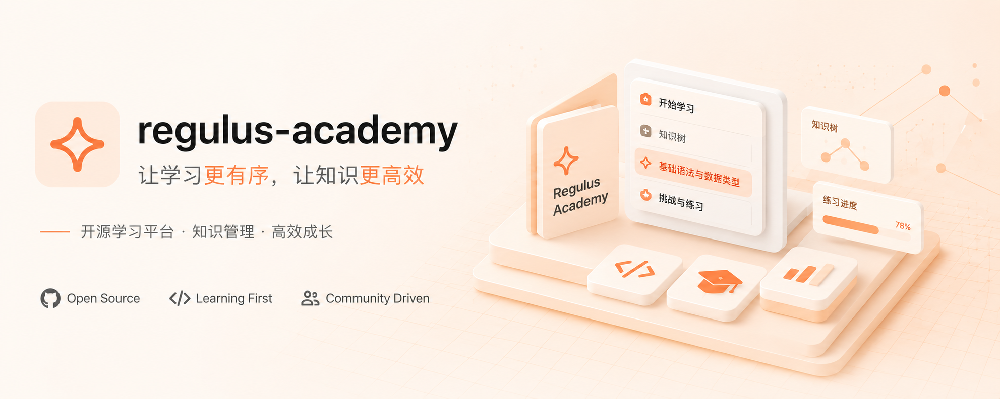
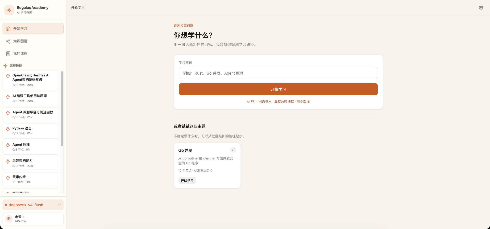
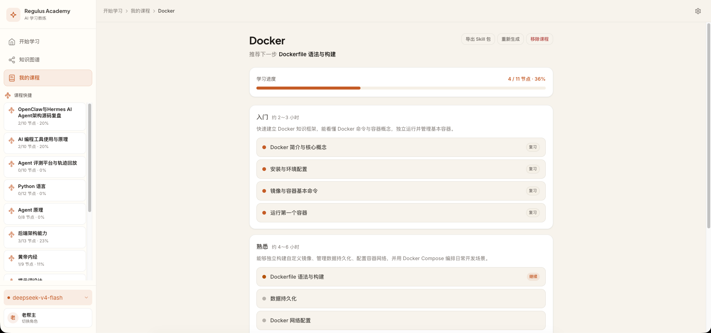
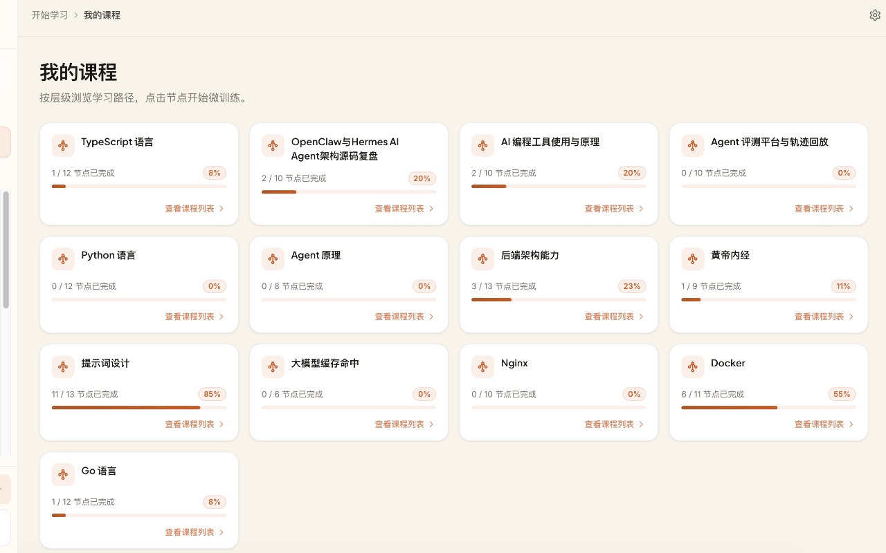
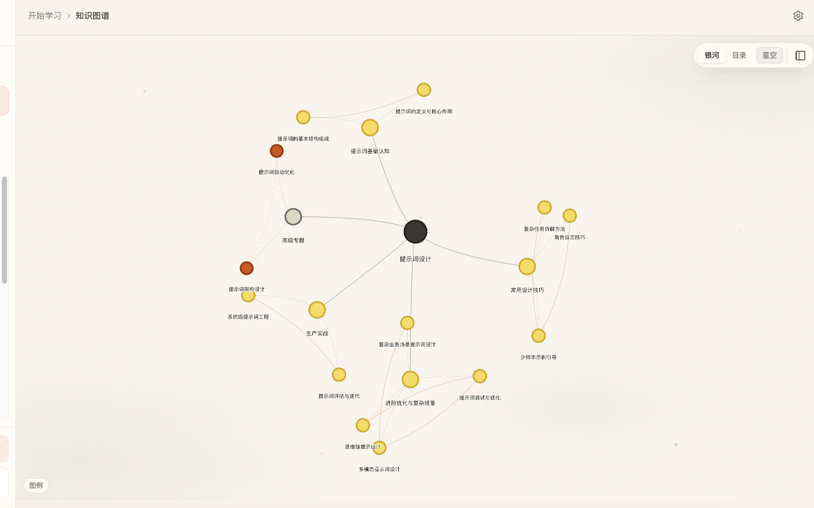
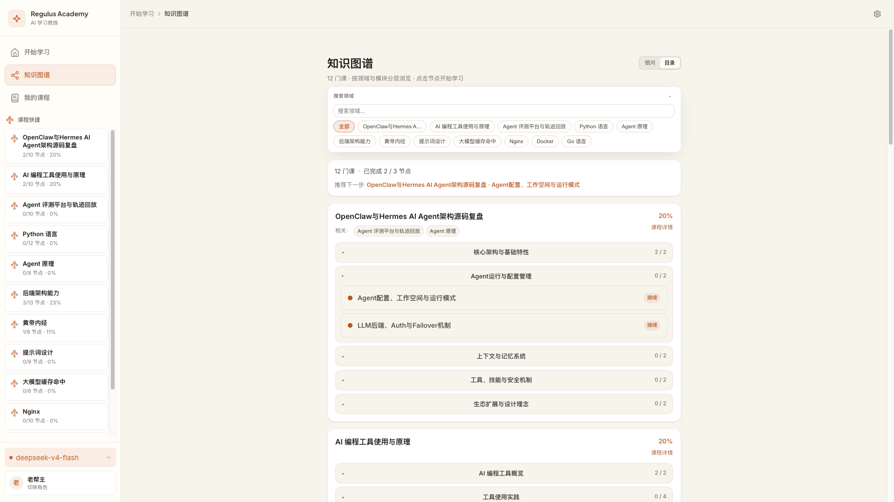
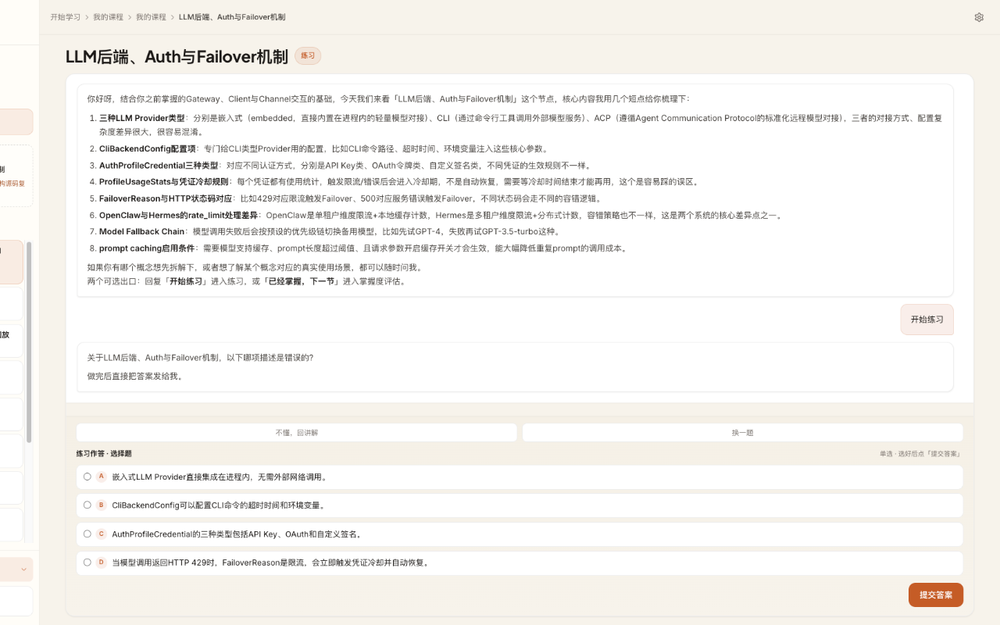
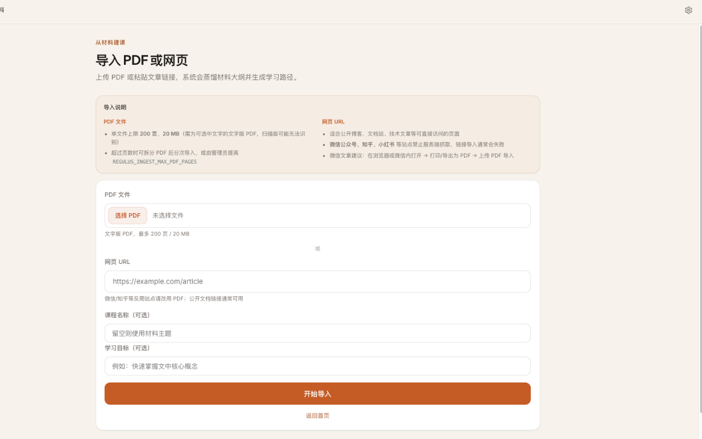

# Regulus Academy — 碎片化学习 AI 私教



> 用一个 LLM Key，在碎片时间里完成一次完整的学习闭环：讲解 → 练习 → 反馈 → 点亮节点 → **沉淀为 Obsidian 知识库**。

**状态：Phase 4 就绪 · 知识银河可视化 · PDF/URL 导入建课 · 纵深扩展 · IM 自然语言导航 | Phase 5 规划中 · 知识沉淀 Obsidian Vault 导出**

---

## 快速开始

### 小白推荐：一条命令（只需 Docker）

安装 [Docker Desktop](https://www.docker.com/products/docker-desktop/) 后，在终端执行：

```bash
curl -fsSL https://raw.githubusercontent.com/liuwenji007/regulus-academy/main/scripts/install.sh | bash
```

脚本会：下载项目到 `~/regulus-academy`、**可选**分步引导配置 `LLM_API_KEY`（可跳过，稍后在 `.env` 填入并重启）、**默认拉取 GHCR 预构建镜像**并启动（通常 30 秒～2 分钟）。完成后打开 **http://localhost:8080** 即可。

| 方式 | 需要安装 | 适合谁 |
|------|----------|--------|
| **安装脚本** | 仅 Docker Desktop | 不想配 Go/Node 的用户 |
| **Docker 手动（镜像）** | Docker + 会 `git clone` | 想自己控制目录、不本地编译 |
| **Docker 手动（本地 build）** | Docker + 会 `git clone` | 改 Dockerfile 或离线环境 |
| **源码开发** | Go + Node + pnpm | 参与改代码的开发者 |

Windows 用户：用 **Docker Desktop + WSL2**，在 Ubuntu 终端里运行上述命令；或在 Git Bash 中执行。

本地已有仓库时也可直接运行：

```bash
bash scripts/install.sh
```

**重复安装 / 已有目录：** 脚本会识别当前目录或 `~/regulus-academy`，尝试 fast-forward 更新；网络失败、本地有改动或需登录 Git 时**不会阻断**，直接用现有代码启动。跳过更新：`REGULUS_SKIP_GIT_UPDATE=1 bash scripts/install.sh`（兼容别名 `REGULUS_SKIP_UPDATE=1`）

**8080 被占用：** 脚本会自动改用 8081、8082… 并写入 `.env` 的 `HOST_PORT`，后续 `docker compose -f docker-compose.image.yml up` 也会沿用。也可手动指定：`REGULUS_PORT=9090 bash scripts/install.sh`

**本地编译镜像：** `REGULUS_BUILD=1 bash scripts/install.sh`（首次约 3～8 分钟，适合改代码或 GHCR 不可达时）

---

### 源码开发（改代码时用）

```bash
# 1. 配置环境变量
cp .env.example .env
# 编辑 .env，填入 LLM_API_KEY（见下方模型配置说明）

# 2. 启动后端
go run ./cmd/server
# 启动日志会显示：LLM: DeepSeek / deepseek-chat

# 3. 启动前端（新终端，开发模式）
cd web && pnpm install && pnpm dev
```

浏览器打开 http://localhost:5173 ，输入「Go 并发」，即可加载内置 Skill；在课程详情页选节点后开始 AI 教练对话。

### Docker 手动启动（含前端构建）

```bash
git clone https://github.com/liuwenji007/regulus-academy.git
cd regulus-academy
cp .env.example .env   # 填入 LLM_API_KEY
docker compose up --build
# 访问 http://localhost:8080（8080 被占用时可在 .env 设置 HOST_PORT=8081）
```

发布镜像后（GitHub Actions 构建完成），可跳过本地 build，更快启动：

```bash
cp .env.example .env   # 填入 LLM_API_KEY
docker compose -f docker-compose.image.yml up -d
```

### 模型配置（`.env`）

```bash
# 推荐：统一变量
LLM_PROVIDER=deepseek    # deepseek | openai | openrouter | ollama | custom
LLM_API_KEY=sk-...
# LLM_BASE_URL=          # 只填域名，不要带 /v1/chat/completions
# LLM_MODEL=             # 可选，覆盖预设模型

# 兼容旧变量
DEEPSEEK_API_KEY=
DEEPSEEK_BASE_URL=https://api.deepseek.com
```

首页会显示「模型已连接」；未配置时提示修改 `.env` 并重启后端。

### 可选：开发期 Langfuse（OTLP）

本地调试 LLM 链路时，可对接**自建** Langfuse（不进 Docker、默认关闭）：

```bash
LANGFUSE_ENABLED=true
LANGFUSE_PUBLIC_KEY=pk-lf-...
LANGFUSE_SECRET_KEY=sk-lf-...
LANGFUSE_BASE_URL=https://jp.cloud.langfuse.com   # 或 EU/US/自建；OTLP 自动用 …/api/public/otel/v1/traces
LANGFUSE_ENVIRONMENT=development
LANGFUSE_LOG_CONTENT=true                 # false 则不记录 prompt 正文
```

仅 `LANGFUSE_ENABLED=true` 时初始化导出；`go run ./cmd/server` 启动日志会打印 OTLP 目标地址。在 Langfuse UI → Tracing 按 `environment=development` 过滤，应能看到 `coach.message`、`domain.build` 等 trace 及子 generation。

**环境要求：** Go 1.22+（见 `go.mod`）、Node.js 18+ 与 pnpm（仅开发前端时需要）。

### Web 页面

| 路由 | 用途 |
|------|------|
| `#/` | 开始学习（输入领域、建课） |
| `#/import` | 从 PDF 或网页 URL 导入材料并蒸馏建课 |
| `#/graph` | 知识银河（多领域全景，缩放切换全景/星座/节点层级） |
| `#/courses` | 我的课程 |
| `#/tree/:id` | 课程详情（按节点列表学习；支持解锁进阶路径） |
| `#/coach/:sessionId` | AI 教练对话 |
| `#/settings` | 设置 |
| `#/settings/profile` | 学习画像查看与对话补充 |
| `#/settings/channels` | IM 频道绑定与 Gateway 配置 |

主路径：**输入领域 → 选节点 → 对话学习**。图谱与课程列表是辅助视图，详见 [DESIGN.md](./DESIGN.md)。

### 教练对话（`#/coach/:sessionId`）

| 能力 | 说明 |
|------|------|
| 讲解 / 答疑 | `explain` 阶段，可随时提问 |
| 开始练习 | 说「开始练习」「继续学习」等；支持短答、选择题、JSON 结构化作答（代码补全 / 找 bug） |
| 实际案例 | 说「实际案例」「生产环境」等，结合工作场景讲解 |
| 批改反馈 | 提交答案后只展示中文反馈；未通过进入 `review`，可「不懂，回讲解」或再练一题 |
| 掌握度评估 | 说「已经掌握，下一节」或「申请完成」：先评估掌握度，不足会指出薄弱点；再次坚持则记录易错概念并完成节点 |
| 节点完成 | 通过后点亮进度；页内可「继续 · 下一节」直接开新会话（无需再打「下一节」） |
| 多角色 | 左下角切换学习角色后，课程快捷与进度按角色隔离（各自 SQLite 用户维度） |

侧栏「正在学习」显示当前节点；「课程快捷」列出本角色全部课程及完成比例。建课、删课、改知识树请在 Web 课程页操作，IM 侧重学习与导航。

**运行测试：**

```bash
make test
```

更多说明见 [CONTRIBUTING.md](./CONTRIBUTING.md) 与 [DESIGN.md](./DESIGN.md)。

---

## 界面预览

> 截图存放于 [`docs/screenshots/`](./docs/screenshots/)。将对应 PNG 放入目录即可显示；清单与拍摄说明见 [`docs/screenshots/README.md`](./docs/screenshots/README.md)。

### 入口与学习路径

| 开始学习 `#/` | 课程详情 `#/tree/:id` | 我的课程 `#/courses` |
|:---:|:---:|:---:|
|  |  |  |

### 知识图谱（双视图）

| 银河视图 `#/graph` | 目录视图 `#/graph?view=outline` |
|:---:|:---:|
|  |  |

### 教练闭环与建课

| AI 教练 · 练习反馈 `#/coach/:sessionId` | 导入建课 `#/import` |
|:---:|:---:|
|  |  |

---

## 一、为什么做这个

我是一个人到中年的工程师。

不是刚毕业的那种焦虑，是另一种——技术在快速更新，我上班消耗大量精力，下班只剩碎片时间。我买过视频课，面对48节通关的课程，我只看了3节；我读过技术书，翻了目录就搁置；我也用过 AI 聊天学习，对话很热闹，但第二天什么都没留下。

2025 年底，我决定自己做一个工具，专门解决这个问题。

不是"AI 家教"，不是"智能课堂"，而是一个教练——知道你在哪、只纠正你最该纠正的那一个动作、让你在 15 分钟内完成一个可测量的进步。

**这个项目是我给自己的礼物，也是我给所有和我一样、在碎片时间里还想保持成长的人的礼物。**

---

## 二、核心定位

面向在职开发者的碎片化学习 AI 教练。不模拟课堂，只做教练——利用碎片时间，一个知识点讲完练完反馈完，进度跨 Web / IM 同步。

有两个核心目标：

1. **从恐惧到起步** — 面对陌生技术栈（Go 并发、Agent 原理…），很多人不是不想学，而是不知从哪开始，怕一旦投入却学不完。知识树把一个领域拆成有限的节点，每个节点独立可完成，解决"看不到边界"的恐惧。

2. **从起步到量化掌握** — 入门 / 熟悉 / 精通三个层级有明确定义：入门能看懂代码，熟悉能写生产代码，精通能排查底层问题。学到哪一级，你自己清楚，面试时也能准确表达。

## 三、目标用户

| 特征 | 描述 |
|------|------|
| 身份 | 想补全技术栈的在职工程师、准备换方向的开发者 |
| 痛点 | 时间碎片化、学了开头学不完、不知道自己是否真的"会了" |
| 需求 | 一个有边界的知识地图 + 一个会追着你练习并给反馈的陪伴者 |
| 场景 | 通勤、午休、下班后的零散时间 |

## 四、借鉴与取舍

做这个之前，认真体验了市面上两个优秀的学习类 AI 项目：

| 项目 | 学到了什么 | 哪里不适合我 |
|------|-----------|-------------|
| [OpenMAIC](https://github.com/THU-MAIC/OpenMAIC) (清华) | 多 Agent 协作的交互设计；知识点结构化呈现的方式 | 沉浸式课堂模式需要整块时间投入；节奏对我来说太慢，碎片场景难以持续 |
| [DeepTutor](https://github.com/HKUDS/DeepTutor) (港大) | RAG 检索增强的思路；自动生成练习的机制 | 配置门槛高（需要 Embedding + 搜索服务）；上班后的疲惫让我没法持续使用 |

这两个都是非常优秀的开源项目，值得一用。只是人到中年的我需要更快、更轻的节奏，所以 Regulus 的答案是：**专注开发者技术领域，用预定义的知识边界代替 RAG，用单次 LLM 调用完成一个完整教学单元，一个 Key 即可启动。**

技术选型也遵循这个逻辑：

- **Go**：编译部署零依赖，单二进制嵌入前端静态文件，Docker 镜像 < 100MB
- **SQLite**：无需数据库服务，进度 / 对话 / 错题全在本地一个文件，随时备份迁移
- **不用 RAG**：大模型已经学过绝大多数开发者技术栈，缺的是边界不是资料
- **OpenAI 兼容 API**：DeepSeek / 本地 Ollama / 任何 OpenAI 兼容接口，一个变量切换

## 五、核心功能

| 功能 | 说明 | 状态 |
|------|------|------|
| 建课 / 知识树 | 输入领域名，匹配内置 Skill 或由 LLM 生成完整路径 | ✅ 已实现 |
| 讲解 → 练习 → 反馈 | 单节点教学闭环：讲解、出题、批改、点亮 | ✅ 已实现 |
| 多种练习作答 | 短答 / 选择题 / JSON（代码补全、找 bug） | ✅ 已实现 |
| 申请完成 / 下一节 | 掌握度评估、完成态一键续下一节点 | ✅ 已实现 |
| IM 自然语言导航 | 规则优先 + LLM 兜底；学习中消息直进教练 | ✅ 已实现 |
| 多学习角色 | Web 切换角色，进度与课程列表隔离 | ✅ 已实现 |
| 主题模块 × 掌握深度 | module 按主题分簇，layer 按入门 / 熟悉 / 精通分层 | ✅ 已实现 |
| 知识银河 | `#/graph` 多领域全景；星座聚类、进度光效、缩放 LOD | ✅ 已实现 |
| 进度可视化 | 课程列表、详情页、银河节点点亮 | ✅ 已实现 |
| PDF/URL 导入建课 | `#/import` 摄取材料 → LLM 蒸馏大纲 → 生成知识树（异步 job） | ✅ 已实现 |
| 纵深扩展 | 完成度 ≥80% 可解锁进阶路径，追加 2～5 个进阶节点并保留进度 | ✅ 已实现 |
| 用户画像裁剪 | 按背景与学习目标聚焦公共 Skill 包 | ✅ 已实现 |
| 新用户引导画像 | 首次进入可选 2～3 题冷启动，压缩为 `profile_summary` | ✅ 已实现 |
| 节末画像回顾 | 节点点亮后异步合并对话进 `profile_summary`（≤500 字），下节讲解自动注入 | ✅ 已实现 |
| 重建保留进度 | 重新生成课程时按 `node_key` 迁移已掌握节点 | ✅ 已实现 |
| 导出 Skill 包 | 导出 self-contained Skill zip，可安装到任意 Agent 直接练习，或贡献 `domains/` 回社区 | ✅ 已实现 |
| IM Channel | Telegram / 钉钉 / 飞书 / 企微，与 Web 共用进度 | ✅ 已实现 |
| 每日推荐 | Agent 根据进度主动推荐 15 分钟微任务 | 规划中 |
| **知识沉淀** | 节点点亮后 LLM 蒸馏对话为学习笔记，导出兼容 Obsidian 的 Vault（含 `[[wikilink]]`、MOC 索引、flashcard） | **Phase 5 规划中** |

## 六、技术架构

| 层级 | 技术选型 | 说明 |
|------|----------|------|
| 分发入口 | Skill + Local Web + IM Channel | Skill 装到 Agent/IDE；Docker 本地跑 Web；企微/飞书/钉钉机器人做通信管道 |
| 后端 | Go (net/http) | 处理用户请求、管理学习状态、调用 LLM API、IM Channel 消息路由 |
| 前端 | Vite + TypeScript PWA | 知识树可视化 + 对话界面，构建后静态文件由 Go 内嵌，无需 Node 运行时 |
| 数据库 | SQLite | 存储用户学习进度、知识树结构、历史对话。跨端共享通过后端统一 |
| 模型 | OpenAI 兼容 API | 支持 DeepSeek / OpenAI / Ollama / 任意兼容接口，填一个 Key 即可 |
| IM | Telegram · 钉钉 · 飞书 · 企微 | WebSocket / Long Polling，内网即可运行，无需公网 |

## 六、分发策略：Skill × Local × Channel 三层

Regulus 有三层分发方式，从零门槛到团队部署，用户按需选择：

### 第一层：Skill（零门槛，装到自己的 Agent/IDE 里）

教练能力抽象为 Agent Skill，可安装到 Hermes、Claude Code 或支持 Skill 的 IDE 中：

```bash
hermes skills install regulus-coach   # 待发布到 Skill 市场
```

也可直接使用仓库内 `regulus-coach/` 目录（见下方文件结构）。**当前推荐 Local 层**（Docker 或源码）作为主力体验。

装好后 Agent 或 IDE 即具备教练能力——建知识树、15 分钟教学、无感错题强化。

### 第二层：Local（本地运行，有 Web 页面）

**预构建镜像（推荐）：**

```bash
git clone https://github.com/liuwenji007/regulus-academy.git
cd regulus-academy
cp .env.example .env   # 填入 LLM_API_KEY
docker compose -f docker-compose.image.yml up -d
# 浏览器打开 http://localhost:8080
```

一键安装脚本会挂载本机 `regulus-coach/`（预构建镜像若未内置 Coach 资源也可正常启动）。若日志出现 `open regulus-coach/protocol.md` 失败，请在安装目录执行：

```bash
cd ~/regulus-academy   # 或你的 REGULUS_INSTALL_DIR
docker compose -f docker-compose.image.yml down
git pull
bash scripts/install.sh
```

**本地编译：**

```bash
git clone https://github.com/liuwenji007/regulus-academy.git
cd regulus-academy
cp .env.example .env
docker compose up --build -d
```

提供可视化知识树、对话界面、进度管理。不依赖任何 Agent 框架，只要有 Docker 就能跑。

### 第三层：Channel（IM 机器人）

Regulus 在本地运行，通过机器人接入 **Telegram、钉钉、飞书、企业微信**。教学逻辑与进度在本地 SQLite，IM 只是通信管道。

```bash
# .env 中开启 Gateway 并填入对应平台凭证
GATEWAY_ENABLED=true
TELEGRAM_BOT_TOKEN=...        # @BotFather 创建
DINGTALK_CLIENT_ID=...         # 钉钉开放平台 → Stream 机器人
FEISHU_APP_ID=...             # 飞书开放平台
FEISHU_MODE=websocket         # websocket（默认）| webhook（需公网 /webhook/feishu）
# 企微需公网 HTTPS：WECOM_ENABLED=true + 回调 URL /webhook/wecom

go run ./cmd/server
```

**首次绑定**：点击 Web 右上角 **设置 → IM 频道**（`#/settings/channels`），生成 6 位绑定码，然后在 IM 中发送：

```
绑定 AB12CD
```

也可以直接发送角色名：`绑定 你的角色名`（需在 Web 端先创建角色）。

绑定成功后可直接用**自然语言**或精确命令导航（建课、删课请在 Web 端操作）：

| 说法示例 | 说明 |
|----------|------|
| `我的课程` / `课程` | 查看课程列表 |
| `学 Go 并发` / `学习 1` | 查看课程节点 |
| `节点 1` / `第一个节点` | 开始/继续学习 |
| `接着学` / `继续` | 续上次进度（有会话时直接进入教练对话） |
| `进度` | 查看完成进度 |
| `帮助` | 可用操作说明 |

仍支持上表对应的精确命令（如 `课程`、`学习 1`、`节点 1`）。模糊说法先走**零 token 规则**，未命中时再用 LLM 解析导航意图（需配置模型）。

**导航与教练分工：**

- 建课、删课、改知识树：仅在 **Web** 操作
- 已有进行中的节点会话时，在 IM 里发消息会**直接进入教练对话**，不会误跳到课表
- 节点已在 `completed` 时，在 IM 说「下一节」会进入下一节点（与 Web「继续 · 下一节」一致）

- Telegram / 钉钉 / 飞书（`FEISHU_MODE=websocket`）：**内网可运行，无需公网**
- 飞书（`FEISHU_MODE=webhook`）/ 企微：需公网 HTTPS
- Web 与 IM **共用同一角色**的学习进度与聊天记录
- Gateway 凭证可在 **设置 → IM 频道** 页面配置；`.env` 中的 `FEISHU_ALLOWED_USERS`（飞书 open_id，逗号分隔）用于限制可绑定用户

### Shared Memory（共享记忆）

三层入口共享同一份记忆——终端上学到一半，换 Web 继续，手机企微里复习。知识树进度、错题记录、教学偏好跨端同步。它们只是容器，教练是同一个。

### Skill 文件结构

```
regulus-coach/
├── SKILL.md              # 教练行为定义
├── protocol.md           # 教学协议
├── domains/              # 知识领域（欢迎贡献新领域）
│   └── go-concurrency/
│       ├── tree.yaml     # 知识树（modules + layers）
│       └── nodes/        # 节点边界定义（核心概念 / 误区 / 不讲什么）
└── tools/
    └── progress.py       # 进度追踪脚本（可选）
```

公共库浏览：`GET /api/domains/public` · 导出：`GET /api/domain/{id}/export`

---

## 七、为什么做这个

我是一名前端在职开发者，工作之余想系统补 后端和 Agent 知识。

不是没时间学，而是时间都是碎的。更大的问题是——拿起一个新技术栈，完全不知道要学到什么程度才算"会了"。看完文档？能写 demo？还是能上生产？这种模糊让我一直拖着不敢开始。

我知道，如果刷文章与短视频学习的碎片化知识并不是真正的学习，需要有结构化的知识才能真正学习与应用，我试过不少学习方法，比如系统学习，整理自己的思维导图，用项目练习。但是我发现很多时候我会变成“为了学而学”，遗忘最初学习的出发点，而变成搜罗我还有哪些不知道的知识，这是事实没有那么多意义相比我付出的时间，因为它们不能带来创造。

体验了 DeepTutor 和 OpenMAIC 之后，我学到了很多——结构化呈现知识点、AI 生成练习、多 Agent 协作——但它们都不太适合我的场景：一个需要配三个 API Key，一个需要坐下来专心听课。

所以我用它们的思路，做了一个更轻的版本：

- **知识树有明确边界**，入门/熟悉/精通每一层是什么，学完你自己知道，面试时也能说清楚

- **极端简易的配置与使用界面**，本地搭建轻量服务后，只要配置模型（推荐 DeepSeek，体验很好），可以专注对话学习与知识树路径
- **每个节点独立完成**，利用零散时间也能学完一个，不会永远学在中途
- **错题会被悄悄强化**，不是让你重做，而是下次换种方式再考你一遍
- **进度跨端同步**，Web 上学到一半，IM 里继续，不依赖哪台设备

一个 API Key，数据在本地，能跑就行。

这是第一个真正帮我从「想学但不敢开始」到「已经会了」的工具。开源出来，希望也能帮到你。也希望有更多人能参与到我们这个团体里，AI时代学习的价值比之前放大了，我们不一定要深入到领域专家，但是当我们能解决问题，AI将是我们最大的助力，AI也必须要为了人而服务。

设计理念详见 [DESIGN.md](./DESIGN.md)。

---

## 八、加入我们

这个项目是一个人开始的，但不希望一个人走完。

如果你：

- 有个技术领域想系统学，**欢迎贡献知识域**（不需要会写代码，只需要用 YAML 定义节点边界）
- 在用 Go / TypeScript / AI Prompt，**欢迎提 PR**，参见 [CONTRIBUTING.md](./CONTRIBUTING.md) 了解模块划分
- 遇到问题或想法，**欢迎开 Issue**，哪怕只是"我不知道从哪里开始学 XX"
- 觉得这个工具有用，**欢迎分享**——一条推文、一个朋友圈、一次 V2EX 帖子，都能帮助更多人找到它

我相信：学习的价值在 AI 时代被放大了，不一定要成为领域专家，但当你能清楚说出"我在哪、我学到了哪一层、下一步是什么"的时候，AI 才真正成为你的助力，而不是替代你思考的工具。

**Star 是最简单的支持，Issues 是最好的对话。**

详见 [CONTRIBUTING.md](./CONTRIBUTING.md) · [DESIGN.md](./DESIGN.md) · [PLAN.md](./PLAN.md)

---

## 许可证

Apache 2.0 · 你的数据只有你和模型知道。

安全漏洞报告见 [SECURITY.md](./SECURITY.md)。

