# Regulus Academy — 碎片化学习 AI 私教

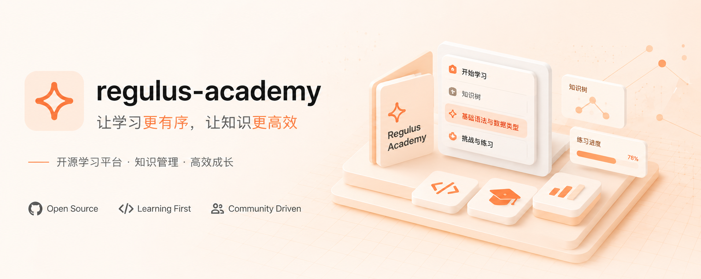

> 在碎片时间完成：讲解 → 练习 → 反馈 → 点亮 → 沉淀为可带走的知识。
>
> **有边界的知识地图 · 会追着你练完的教练 · 越学越懂你**

**状态：** 公开试用 · 知识图谱 · 教练闭环 · 画像裁剪 · Obsidian 导出 MVP · 行动助手 · 课程体检 ✅　|　复习闪卡 · Agent 维护笔记 · RAG · **Agent 主动日推** — 规划中

### 在线体验

| | 链接 |
|---|------|
| **在线 Demo** | https://demo.awoshuile.cn |
| **使用文档** | https://regulus-academy-docs.vercel.app |
| **GitHub** | https://github.com/liuwenji007/regulus-academy |

- **Demo**：无需先备 Key（平台日额度；用尽后可填写自己的 Key 继续）
- **自托管 / 长期使用**：一个 OpenAI 兼容 Key 即可；数据在本机。见 [自托管部署](https://regulus-academy-docs.vercel.app/guide/self-host)

---

## 差别在哪

相对「用 ChatGPT / Claude 聊天学」：

1. **有边界的知识地图，不是无限聊天** — 每个节点钉死讲什么 / 易错什么 / 不讲什么
2. **会追着你练完并点亮的教练，不是讲完就走的老师** — 讲解 → 练习 → 批改 → 点亮
3. **越学越懂你——讲解按你的背景裁剪** — 不重复你会的，只练你弱的

Cloud 先免费试用；自托管则进度与笔记留在本机。

曾认真用过 [OpenMAIC](https://github.com/THU-MAIC/OpenMAIC)（学到结构化呈现与多 Agent）与 [DeepTutor](https://github.com/HKUDS/DeepTutor)（学到练习生成与 RAG 思路）；它们优秀，但课堂节奏或配置门槛不适合碎片场景——Regulus 用预定义边界代替 RAG，单次闭环即可完成一个可测量进步。

---

## 你会得到什么

| 结果 | 说明 |
|------|------|
| **节点可点亮** | 讲练批闭环；熟悉/精通层含应用题与掌握度评估 |
| **地图有边界** | 入门 / 熟悉 / 精通分层；多领域知识图谱可视进度 |
| **越学越懂你** | 全局画像 + 按课摘要，建课与讲解按缺口裁剪 |
| **学完可带走** | 导出 Domain 包、Coach Skill、Obsidian 学习笔记 |

另外：不知从哪开课可用 [内置课目录](https://regulus-academy-docs.vercel.app/guide/features#建课与导入)；节奏乱可用 [行动助手](https://regulus-academy-docs.vercel.app/guide/action-assistant)；课质量可 [体检与优化](https://regulus-academy-docs.vercel.app/guide/course-audit)。

---

## 立刻开始

### A. 在线 Demo（推荐，零 Key）

打开 [demo.awoshuile.cn](https://demo.awoshuile.cn) → 创建角色 → 输入主题或从「课程目录」开课 → 选节点练到点亮。

限额与限制见 [在线体验版](https://regulus-academy-docs.vercel.app/guide/cloud-demo)。

### B. 本机 Docker（数据留本机，需 Key）

先装 [Docker Desktop](https://www.docker.com/products/docker-desktop/)。

**一键脚本**（自动 clone、拉镜像、启动）：

```bash
curl -fsSL https://raw.githubusercontent.com/liuwenji007/regulus-academy/main/scripts/install.sh | bash
```

**或手动三步**（想自己控制目录）：

```bash
# 1. 拉代码
git clone https://github.com/liuwenji007/regulus-academy.git
cd regulus-academy

# 2. 配 Key（编辑 .env，填入 LLM_API_KEY；可用 DeepSeek / OpenAI / 任意兼容接口）
cp .env.example .env

# 3. 起服务（拉预构建镜像，约 30 秒～2 分钟）
docker compose -f docker-compose.image.yml up -d
```

打开 **http://localhost:8080**，输入「Go 并发」即可开练（8080 被占用时在 `.env` 设 `HOST_PORT`）。更新只需重跑一键脚本。

### C. 源码运行（不装 Docker）

> 后端是 Go，前端是 Vite/Node，需要 Go + Node(pnpm) 两个运行时，开两个进程。

```bash
git clone https://github.com/liuwenji007/regulus-academy.git
cd regulus-academy
cp .env.example .env            # 填入 LLM_API_KEY

# 终端 1：Go 后端
go run ./cmd/server

# 终端 2：前端（Vite dev）
cd web && pnpm install && pnpm dev
```

打开 **http://localhost:5173** 开练（后端默认 8080，前端 dev 已配代理）。

还可用：主页下载 **Coach Skill**（装到 Cursor 等 Agent）；自托管可接 **IM**（Telegram / 钉钉 / 飞书 / 企微，部分需公网 HTTPS）。详见 [Coach Skill](https://regulus-academy-docs.vercel.app/guide/agent-offline) · [IM 频道](https://regulus-academy-docs.vercel.app/guide/im) · [自托管](https://regulus-academy-docs.vercel.app/guide/self-host) · [环境变量](https://regulus-academy-docs.vercel.app/reference/env)。

技术选型：Go + SQLite + OpenAI 兼容 API，不必先配 Embedding / RAG。

---

## 长什么样

完整图集见 [界面预览](https://regulus-academy-docs.vercel.app/guide/screenshots)。

### 入口与学习路径

| 开始学习 | 课程详情 | 我的课程 |
|:---:|:---:|:---:|
| 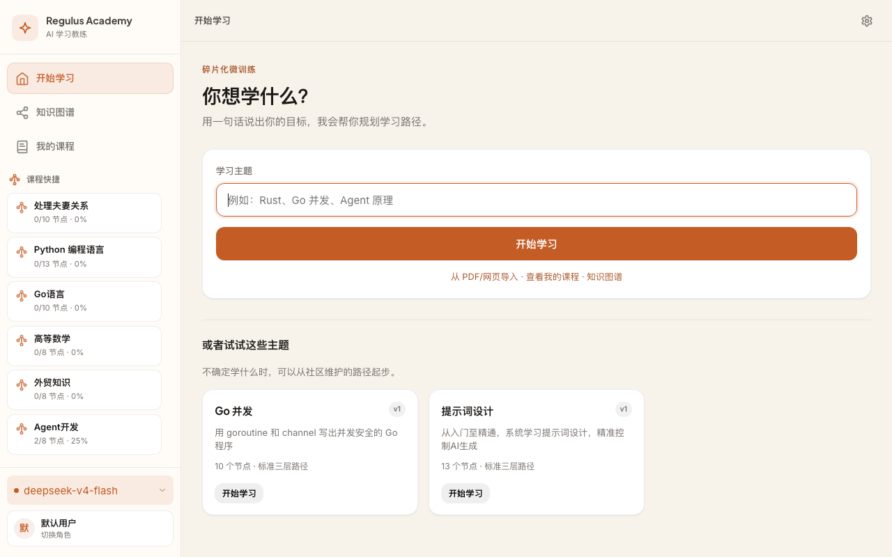 | 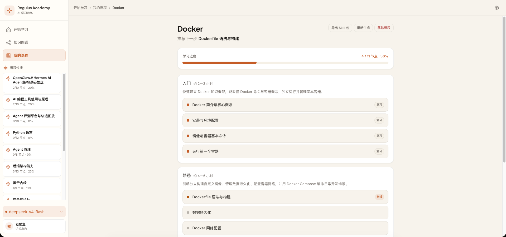 | 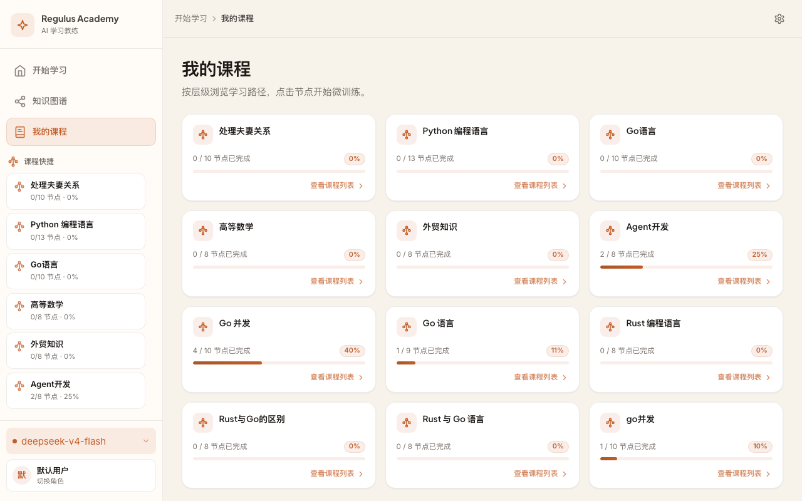 |

### 教练闭环与建课

| AI 教练 · 练习反馈 | PDF / URL 导入建课 |
|:---:|:---:|
| 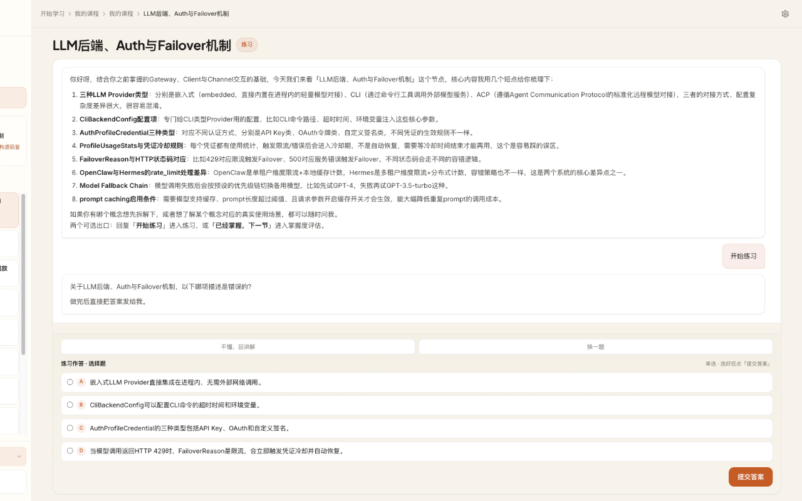 | 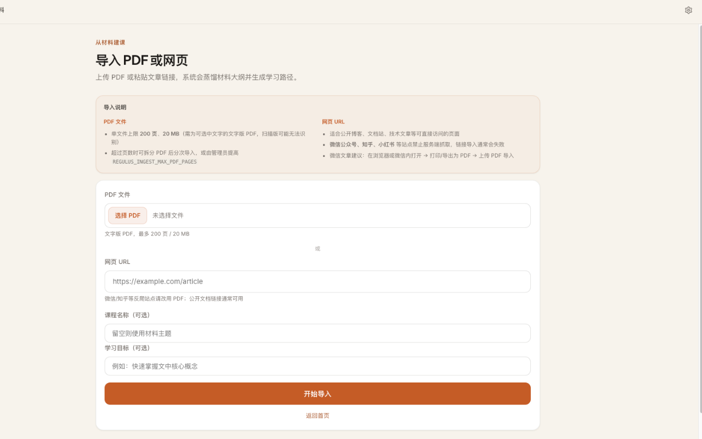 |

### 知识图谱

| 图谱 · 宣纸（默认） | 图谱 · 星空 | 目录 |
|:---:|:---:|:---:|
| 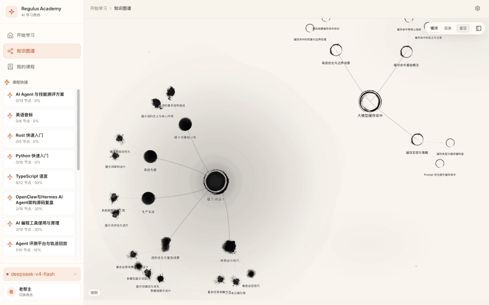 | 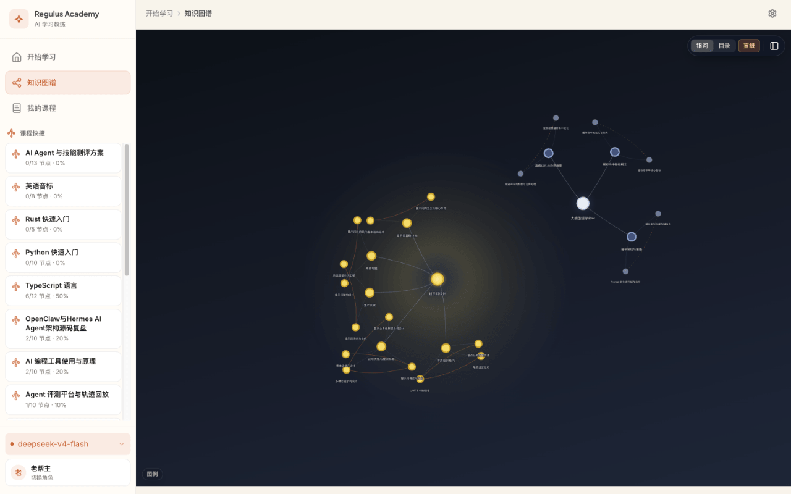 | 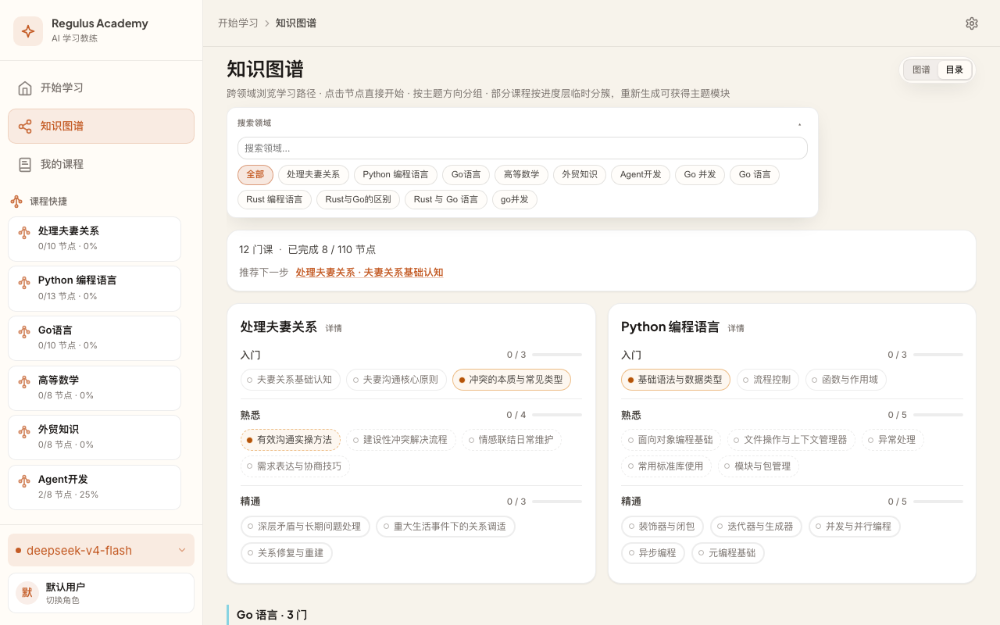 |

### 在线体验版（Cloud）

| Cloud 首页 | 角色创建 | 设置 |
|:---:|:---:|:---:|
| 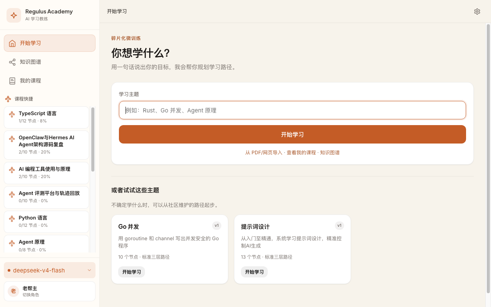 | 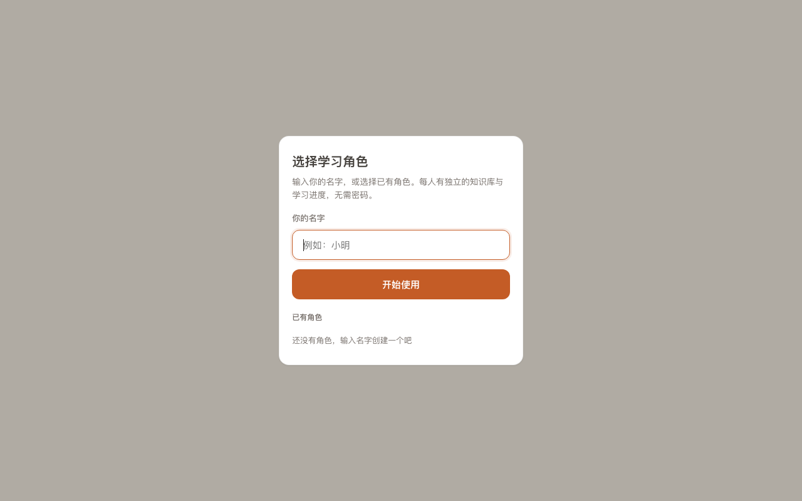 | 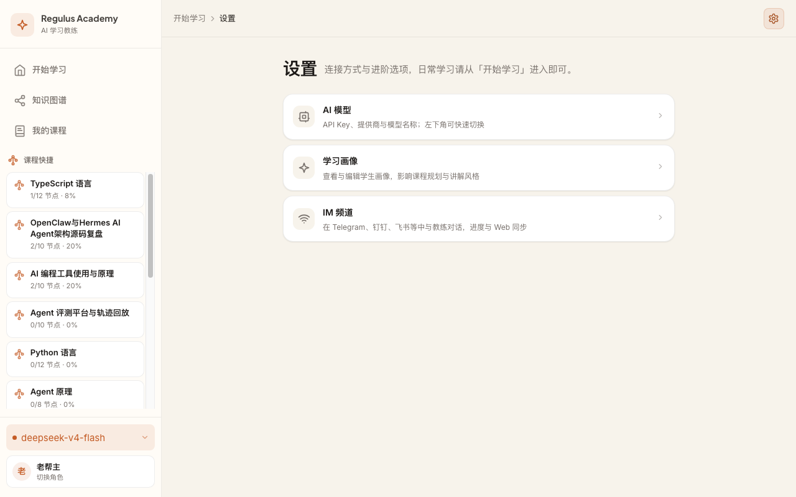 |

---

## 为什么做这个

我是一个人到中年的在职工程师。

技术在快速更新，我上班消耗掉大部分精力，下班只剩碎片时间。人在焦虑中，只有学习可以帮助我缓解。我买过视频课，面对 48 节通关的课程，只看了 3 节；我读过技术书，翻了目录就搁置；我也用 AI 聊天学习，知识不够体系，聊完后除了一些笔记没剩下多少。

更麻烦的是，拿起一个新技术栈，完全不知道要学到什么程度才算「会了」。看完文档？能写 demo？还是能上生产？这种模糊让我处于恐惧中，拖着不敢开始。

2025 年底，我决定自己做一个工具来解决这个问题。我不需要一个讲课详尽的老师，而是一个教练——知道我在哪、记得我已会什么、只纠正最该纠正的那一个动作，在约 15 分钟里完成一次可测量的进步。我需要的是以微小不适让我踏出舒适区，快速入门一个原先不敢涉足的领域，学习本不应该痛苦。

所以我参考了那些优秀产品的思路，做了一个更轻的版本：

- **知识树有明确边界**，入门 / 熟悉 / 精通每一层是什么，学完你自己知道，面试时也能说清楚
- **越学越懂你**，画像随对话更新：建课裁剪、讲解跳过冗余、纵深扩展按现有掌握向外生长，练习只打薄弱点
- **配置尽量简单**，本地搭好后只要配一个模型 Key（推荐 DeepSeek），就能专注对话与知识树路径
- **每个节点独立完成**，利用零散时间也能学完一关，不会永远卡在中途
- **错题会被悄悄强化**，不是让你重做，而是下次换种方式再考你一遍
- **进度可跨端同步**（自托管），Web 上学到一半，IM 里继续

一个 API Key 就能用；自托管时数据在本机，能跑就行。

**这个项目是我给自己的礼物，也是给所有和我一样、想在碎片时间里保持成长的人的礼物。**

设计原则见 [DESIGN.md](./DESIGN.md)；站内短述见 [为什么是 Regulus](https://regulus-academy-docs.vercel.app/guide/why-regulus)。

---

## 加入我们

- 改进教练点亮或节点教考质量 → [教学质量](https://regulus-academy-docs.vercel.app/guide/contributing-teaching)
- 贡献知识域（YAML 定义节点边界即可）→ [CONTRIBUTING.md](./CONTRIBUTING.md)
- 试用反馈 → [`[体验]` Issue](https://github.com/liuwenji007/regulus-academy/issues/new?template=experience_feedback.yml)

**Star 是最简单的支持，Issues 是最好的对话。**

---

## 许可证

Apache 2.0。

自托管：学习数据在本机 SQLite。Cloud Demo：共享试用环境，请勿放入敏感内容；额度用尽后可填写自己的 Key 继续。

安全漏洞报告见 [SECURITY.md](./SECURITY.md)。
