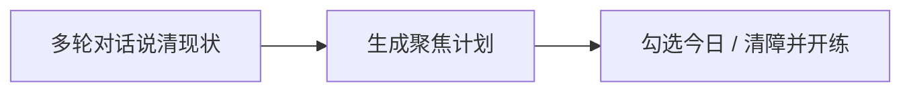

# 行动助手

行动助手帮你在碎片时间里**恢复学习节奏**：理清过载事务、钉住北星、勾出今日行动与清障项，而不是做一个通用待办看板。

**入口**：侧栏「行动助手」→ `#/assistant`（继续上次会话：`#/assistant/:sessionId`）

## 适合什么场景

- 事情太多，不知道今天该先学什么
- 学习被杂事务打断，需要先「清障」再开练
- 想把「本周楔子 / 今日学习」和对齐到具体课程节点

不适合：把行动助手当团队任务管理或长期项目管理工具。

## 用法（3 步）

1. 在对话里描述工作 / 生活 / 学习上卡住的事（过载时助手会帮你分流）
2. 生成计划后关注顶部：**北星**、本周楔子、今日学习、今日行动、清障项
3. 需要时展开四象限看细节；勾选完成项会跨会话保留
4. 侧栏「今日推荐」会优先引用计划里的学习焦点，一键进入对应节点

## 计划结构

| 区块 | 作用 |
|------|------|
| 北星（`north_star`） | 当前最该推进的一条线；可钉住，避免每次重谈 |
| 本周楔子 | 本周推进北星的最小切口 |
| 今日学习 | 建议学什么、大约几分钟；尽量匹配已有课程 / 节点 |
| 清障 | 挡在学习前面的小事，先处理再开练 |
| 今日 / 本周行动 | 可勾选清单，跨会话保留勾选状态 |
| 四象限 | Eisenhower 矩阵，默认折叠，展开看分类详情 |
| 心态提示 | 一两句节奏上的提醒 |

新开会话：在行动助手页选「新对话」，或访问 `#/assistant?new=1`。

## 与学习捷径的关系

侧栏同时展示：

| 区域 | 数据来源 |
|------|----------|
| 上一节 | 最近一次有进度的教练会话，可直接续练 |
| 今日推荐 | **优先**行动助手计划中的今日学习；否则按课程进度推荐未完成节点（最多 2 条） |

完整功能索引见 [功能一览](./features.md)。

## 相关页面

- [快速上手](./quick-start.md)
- [教练流程](./coach-flow.md)
- [功能一览](./features.md)
