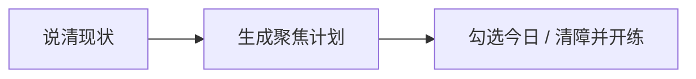

# 行动助手

事情一多，人就不知道今天该先学什么、甚至没心思学。行动助手就是帮你**把脑子里乱成一团的事说出来，然后理出「今天先做这一件、再学这一点」**，让你重新学得下去。它不是通用的待办清单工具。

**入口**：点左侧边栏的「行动助手」。

## 什么时候用它

- 事情太多，不知道今天该先学什么
- 学习总被杂事打断，得先清掉几件小事才静得下心
- 想把「这周想推进的事」落到具体某门课、某一关上

## 怎么用

1. 在对话里把工作 / 生活 / 学习上卡住的事说清楚（说乱了也没关系，它会帮你分类）
2. 它生成一份计划，顶部就是**现在最该盯的一件事**，下面是今天学什么、要先处理哪些小事
3. 勾掉做完的事（换个对话再回来也还在）
4. 侧栏「今日推荐」会直接引用计划里的学习焦点，点一下就进对应的课

查看流程图

## 计划里有哪些部分

它生成的计划用了几个固定说法，对照理解即可：

| 区块 | 说的是 |
|------|------|
| 北星 | 当前最该推进的**那一件事**；可以钉住，不用每次重讲 |
| 本周楔子 | 这一周推进北星的**最小一步** |
| 今日学习 | 今天建议学什么、大概几分钟；尽量对上你已有的课 |
| 清障 | 挡在学习前面的小事，先清掉再开练 |
| 今日 / 本周行动 | 可勾选的清单，换会话也保留勾选状态 |
| 四象限 | 按「重要 / 紧急」分类的详情，默认折叠 |
| 心态提示 | 一两句节奏上的提醒 |

新开一份计划：在行动助手页选「新对话」。

## 与学习捷径的关系

侧栏同时展示：

| 区域 | 数据来源 |
|------|----------|
| 上一节 | 最近一次有进度的教练会话，可直接续练 |
| 今日推荐 | **优先**行动助手计划中的今日学习；其次若有未关闭的**知识缺口**且能匹配到本课节点，会插入一条带理由的推荐（如「侧重补：幂等」）；否则按课程进度推荐未完成节点（最多约 2 条） |

缺口从哪来、怎么关，见 [划词助教](./aside-assistant.md)。

完整功能索引见 [功能一览](./features.md)。

## 相关页面

- [快速上手](./quick-start.md)
- [教练流程](./coach-flow.md)
- [划词助教](./aside-assistant.md)
- [功能一览](./features.md)
