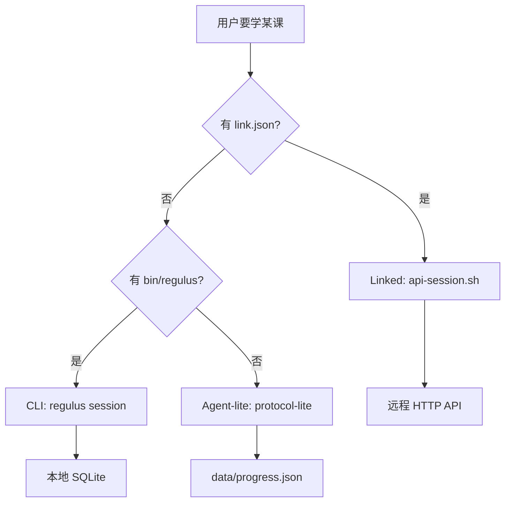

# Agent 离线练习

在 OpenClaw、Cursor 等 Agent 环境中，用 Regulus 教练做 **讲解 → 练习 → 批改** 闭环，无需一直开着浏览器。

## 获取 Skill 包（lite）

1. 打开 Regulus 主页，点击右上角 **「Agent 离线练习」**
2. 下载 `regulus-coach.zip`（约几 MB，**不含** CLI 二进制）并解压到 Agent skills 目录

包内说明：

| 文件 | 用途 |
|------|------|
| `SKILL.md` | Agent 必读：模式选择、流程 |
| `USAGE.md` | 安装、建课、会话完整教程 |
| `protocol-lite.md` | Agent-lite 精简协议 |
| `agent-prompts.md` | 讲解 / 出题 / 批改要点 |
| `scripts/api-session.sh` | Linked 模式 HTTP 会话 |
| `schemas/` | exercise / grade / progress JSON |
| `domains/` | 内置公共课程 |

可选 **regulus CLI**（与 Web 同状态机）：[GitHub Releases](https://github.com/liuwenji007/regulus-academy/releases) 或自托管 `GET /api/coach/cli?platform=darwin_arm64`。

## 三种模式



| 模式 | 条件 | 教练逻辑 | 进度 |
|------|------|----------|------|
| **Linked**（推荐） | `.regulus/link.json` | `scripts/api-session.sh` | 服务端 |
| **CLI**（可选） | `bin/regulus` + Key | `regulus session` | 本地 DB，可 sync |
| **Agent-lite** | 默认 | `protocol-lite` + schemas | `data/progress.json` |

## 快速开始（Linked，已部署 Regulus）

```bash
cd regulus-coach
cp .regulus/link.json.example .regulus/link.json
# 编辑 apiUrl、userId

bash scripts/api-session.sh start --slug go-concurrency
bash scripts/api-session.sh message --session <id> "开始练习"
```

对 Agent 说「我想学 Go 并发」时：检查 `domains/` → 缺课则 `build-domain.sh` → 有 link 则走 `api-session.sh`。

::: tip 推荐
已部署 Regulus 的用户优先 Linked 模式，与 Web 共用进度与完整状态机。
:::

## 快速开始（Agent-lite，纯离线）

1. 读 `domains/<slug>/nodes/<key>.yaml` 与 `agent-prompts.md`
2. 按 `protocol-lite.md` 讲解 → 出题 → 批改
3. 节点通过后更新 `data/progress.json`

Linked / CLI 模式下 Agent **不得**即兴编造讲解或练习题。

## 可选 CLI

```bash
# 示例：macOS Apple Silicon
curl -fsSL "https://你的实例/api/coach/cli?platform=darwin_arm64" -o bin/regulus
chmod +x bin/regulus
./bin/regulus doctor
```

平台：`darwin_arm64`、`darwin_amd64`、`linux_amd64`、`linux_arm64`。

## 叠加你在 Web 建的课

1. 课程详情 **「导出 Domain 包」** → `{slug}-domain.zip`
2. 解压后将 `{slug}/` 复制到 `regulus-coach/domains/`

## 与 Web 同步进度（CLI）

```bash
./bin/regulus link --url https://你的-regulus-地址 --user-id default
./bin/regulus sync pull
./bin/regulus sync push
```

## 命令参考

```bash
bash build-domain.sh "想学 TypeScript"
bash scripts/api-session.sh start --slug <slug>
bash scripts/api-session.sh message --session <id> "用户原话"
./bin/regulus session start --slug <slug>    # 可选 CLI
```

开发者在仓库根目录 `make cli` 构建 `bin/regulus`。

## 延伸阅读

- 包内 [USAGE.md](https://github.com/liuwenji007/regulus-academy/blob/main/regulus-coach/USAGE.md)
- [功能一览 · 下载 Coach Skill](./features.md#下载-coach-skill主页)
- [参与贡献 · 提交 Domain](./contributing.md)
