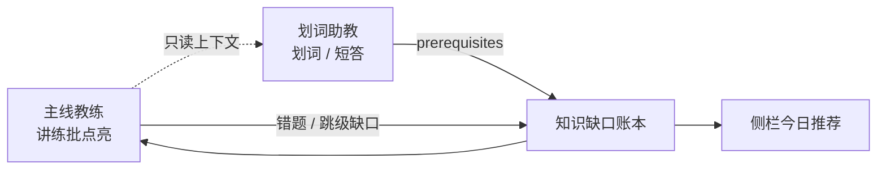

# 划词助教

> 主线**教练**负责「讲练批点亮」；**助教**负责划词解术语、读音、短发散——并把「你卡住」沉淀成可推荐的知识缺口。助教只解词，不带课。

第一次用建议先走完 [快速上手](./quick-start.md) 的主线闭环，再在教练页试用助教。

## 它解决什么

听讲解时常见三种卡点：

| 卡点 | 例子 | 入口 |
|------|------|------|
| 编码障碍 | 英文术语不会读、翻译对不上 | 划词 →「怎么读」 |
| 锚点缺失 | 突然冒出一个前置概念完全不懂 | 划词 →「这是什么」 |
| 关联冲动 | 已听懂，想多问一句 | 划词 →「展开讲」或右侧自由提问 |

这些都不该打断主线进度：助教**只读**当前课上下文，**不写** `sessions` / 掌握度 / 错题表，不会把你推进下一阶段。

## 怎么用

### 1. 划词（推荐）

1. 打开任意节点的 [教练对话](./coach-flow.md)
2. 在助手气泡里**划选**关键词（约 1～80 字）
3. 浮出气泡选：**这是什么** / **怎么读** / **展开讲**
4. 右侧面板自动打开，展示结构化术语卡（定义、读音、类比、与本课关系、可能缺的前置）

### 2. 右侧面板常驻

- 顶栏右侧面板按钮，或快捷键 **`Cmd/Ctrl + K`**
- 面板标题为 **助教**；三个 Tab：
  - **对话**：自由提问（末尾会导回主线）
  - **术语本**：本课查过的词（可点开回看）
  - **知识缺口**：系统沉淀的「你可能还不熟」列表，可点「已懂」关闭

离开教练页后面板可继续开着，但建议在有当前课上下文时使用，回答更贴课。

## 和主线教练的分工

| | 主线教练 | 划词助教 |
|--|----------|----------|
| 职责 | 推进节点、出题、点亮 | 解词、解释、短发散 |
| 是否改进度 | 是 | **否** |
| 模型 | 当前「使用中」模型 | 可另选轻量模型（见下） |

## 知识缺口与推荐

助教不是「第二个老师」，真正的长期价值是**观测你卡住**：

1. 术语卡里的 `prerequisites`、练习答错、申请跳级时的薄弱点 → 写入同一账本
2. 教练讲解时会注入 top 缺口，讲到相关处多铺一两句
3. 侧栏「今日推荐」可出现 **缺口** 来源，并带理由（如「你查过 N 次幂等」）

学完对应节点后，映射到该节点的缺口会自动关闭；也可在「知识缺口」Tab 手动点「已懂」。

详见 [行动助手 · 学习捷径](./action-assistant.md#与学习捷径的关系)。

## 助教模型（可选）

设置 → **AI 模型** → **划词助教模型（轻量）**：

- 默认与「当前使用」相同
- 可指定更便宜/更快的模型，避免与主线教练抢配额

见 [AI 模型配置 · 场景模型绑定](./model-config.md#场景模型绑定可选)。

## 界面示意

静态截图与动图规范见 [界面预览](./screenshots.md) · [截图与动图清单](https://github.com/liuwenji007/regulus-academy/blob/main/docs/screenshots/README.md#划词助教截图与动图)。

| 划词气泡（建议动图） | 右侧面板 · 术语卡 |
|:---:|:---:|
| 见仓库 `docs/screenshots/aside-selection.gif`（待补） | 见 `docs/screenshots/aside-panel.png`（待补） |

## 相关

- [教练流程](./coach-flow.md) — 主线阶段机
- [学习画像](./learning-profile.md) — 背景裁剪（与缺口互补）
- [功能一览](./features.md)
