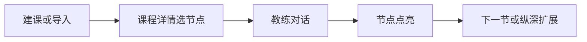
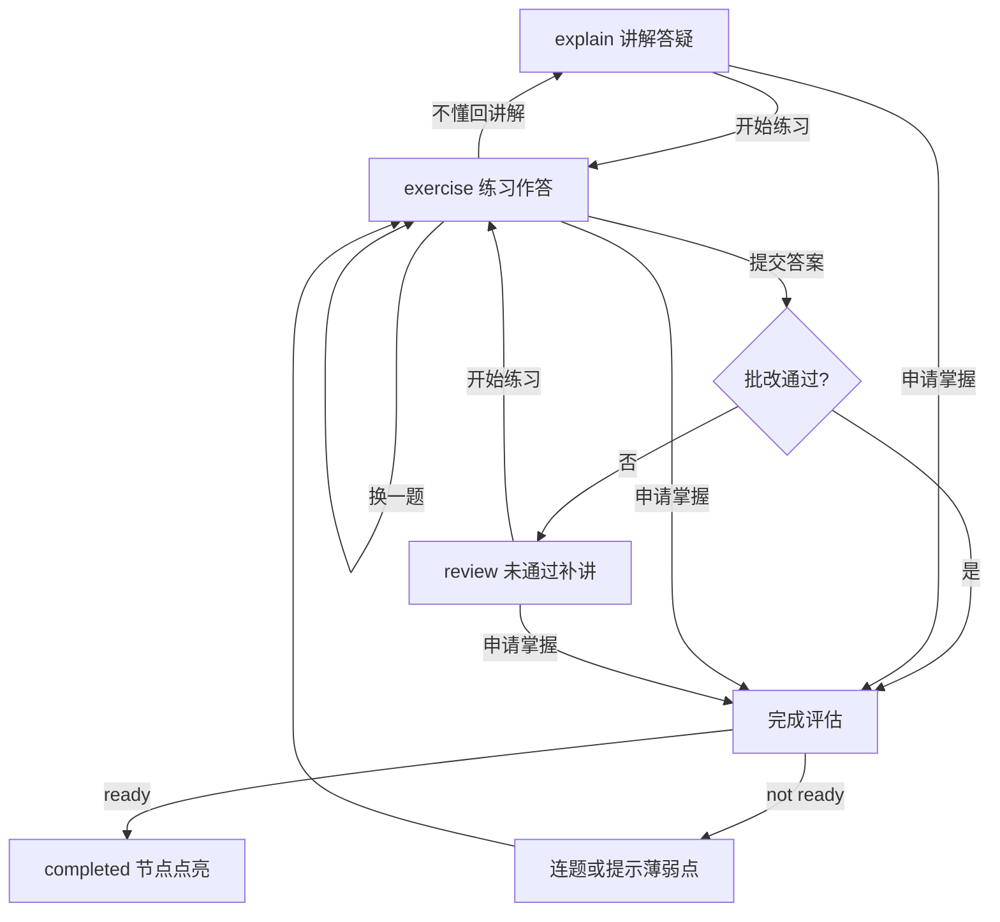

# 教练流程

本文说明 AI 教练对话的**阶段状态**、**你能说什么**，以及**节点如何点亮**。教学模式背景见 [教学模式](./teaching-model.md)。

## 主路径

快速上手步骤见 [快速上手](./quick-start.md)。

## 会话阶段（Phase）

| Phase | 含义 | 你能做什么 |
|-------|------|------------|
| `explain` | 讲解与答疑 | 提问；说「开始练习」进入练习；可申请掌握 |
| `exercise` | 已出题，等待作答 | 提交答案；说「不懂/回讲解」；说「换一题」；可申请掌握 |
| `review` | 首次未通过后补讲 | 提问；说「开始练习」再练；可申请掌握 |
| `completed` | 本节点已点亮 | Web 点「继续 · 下一节」或 IM 说「下一节」；也可回知识树选其他节点 |

教练**不会**在自由对话里自行宣称「节点已通过」——点亮由系统在批改通过或掌握度评估通过后执行。

## 状态流转

## 用户话术

| 意图 | 示例说法 | 效果 |
|------|----------|------|
| 开始练习 | 开始练习、准备好了、出题、来一题 | `explain` / `review` → `exercise` |
| 提交答案 | （你的作答内容） | `exercise` → 批改 |
| 不懂回讲 | 不懂、回讲解 | `exercise` → `explain` |
| 换题 | 换一题 | 重新出题（仍在 `exercise`） |
| 实际案例 | 实际案例、生产环境 | 结合工作场景讲解 |
| 申请完成 | 已经掌握下一节、申请完成 | 触发掌握度 / 完成评估 |
| 续下一节 | Web「继续 · 下一节」/ IM「下一节」 | `completed` → 下一节点新会话 |

IM 中若已有进行中的节点会话，发消息会**直接进入教练对话**，不会被导航命令打断。建课、删课请在 Web 操作。

## 答对后如何点亮

练习批改 `passed=true` 后，系统按以下顺序判断是否点亮本节点：

### 1. 记录进度

- 本题 `reinforced_concepts` 记入会话「已考查」列表。
- 若本题是**应用级**练习（代码补全 / 找 bug），标记「已通过应用级练习」。

### 2. 规则建议（非最终裁决，默认模式下）

系统检查两条规则，满足时**建议**再练一题，而不是立刻点亮：

| 规则 | 条件 | 说明 |
|------|------|------|
| 概念覆盖 | 核心概念 ≥3 且仍有 ≥2 个未在练习中考到 | `REGULUS_STRICT_CONCEPT_COVERAGE`（默认开） |
| 应用练习 | 熟悉/精通层且尚未通过应用级练习 | `REGULUS_REQUIRE_APPLY_EXERCISE`（默认开）；**入门层豁免** |

### 3. LLM 综合评估（默认开启）

`REGULUS_LLM_COMPLETION_CHECK=1`（默认）时：

- 结合全节对话、练习与答疑，输出 `ready` / `gap_concepts`。
- 规则建议仅作为上下文提示；若答疑/深讲中已充分体现掌握，模型可 `ready=true`（软豁免覆盖或 apply 建议）。
- `ready=true` → **点亮节点**。
- `ready=false` → 给出反馈并**自动连下一题**（优先考查薄弱概念或 apply 题）。

### 4. 关闭 LLM 评估时（`REGULUS_LLM_COMPLETION_CHECK=0`）

- **练习答对**：规则满足则硬挡并连题；否则直接点亮。
- **申请掌握**：仍调用掌握度 JSON 评估；`ready` 且规则满足时连题；`not ready` 时留在当前阶段并提示薄弱点，**不自动出题**。

适合弱模型或需要完全确定性行为的部署。

## 申请掌握（跳过练习）

在 `explain` / `exercise` / `review` 可说「已经掌握，下一节」：

1. **首次评估 not ready**（LLM 开时）：可能自动连题；若走申请路径会标记已提醒，并提示可再次申请。
2. **再次坚持申请**：系统记录易错概念并**强制完成**本节点（适合「我知道有薄弱点但想先过」的场景）。

Web 与 IM 行为一致；完成态用「继续 · 下一节」进入下一节点，无需再打「下一节」口令。

## 节点内多概念

节点常有多个 `core_concepts`。侧栏与 prompt 中的【待考查】列出尚未在练习中考到的概念；出题会优先覆盖这些概念，且**不得考查**对话中未出现过的概念。

## 配置速查

| 变量 | 默认 | 作用 |
|------|------|------|
| `REGULUS_STRICT_CONCEPT_COVERAGE` | 开 | 多概念覆盖门槛建议 |
| `REGULUS_REQUIRE_APPLY_EXERCISE` | 开 | 熟悉/精通层 apply 练习建议 |
| `REGULUS_LLM_COMPLETION_CHECK` | 开 | 点亮前 LLM 综合评估 |

组合示例与全部环境变量见 [环境变量](../reference/env.md)。

## 相关页面

- [教学模式](./teaching-model.md) — 为什么这样设计
- [贡献 · 教学质量](./contributing-teaching.md) — 维护者纠结点与贡献路径
- [功能一览](./features.md) — 导出、纵深扩展、知识银河
- [界面预览](./screenshots.md) — 教练页截图
