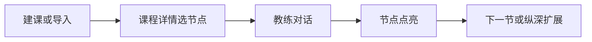
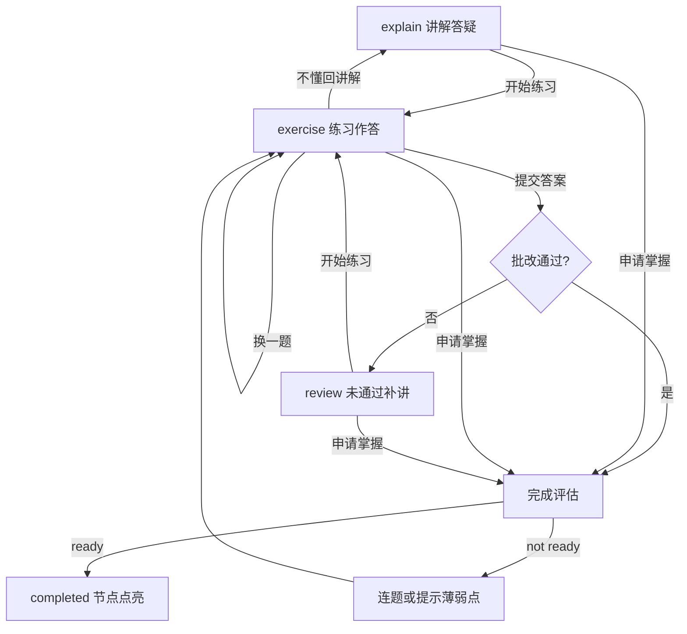

# 教练流程

> 第一次用建议先看 [快速上手](./quick-start.md)。本页讲得更细：和 AI 教练对话时它会经历哪几种状态、你可以打什么话、以及一关怎样才算「学会（点亮）」。

## 整体流程

跟教练聊天，其实就在四种状态之间走：

1. **听讲**（它给你讲这一关）→ 你说「开始练习」
2. **做题**（它出一道小题）→ 你作答
3. **没过就补讲**（讲错在哪，再练）
4. **过了就点亮**（这一关完成，进下一关）

你不用记状态名，正常聊天、想练就说「开始练习」、不懂就说「不懂」即可。下面的表和图供想了解细节时查阅。

查看完整流程图

```mermaid
flowchart LR
  build[建课或导入] --> pick[课程详情选节点]
  pick --> coach[教练对话]
  coach --> done[节点点亮]
  done --> next[下一节或纵深扩展]
```

## 会话阶段（Phase）

「Phase」就是**上面说的四种状态**的英文名，看到界面里出现时对照即可：

| Phase | 意思 | 你能做什么 |
|-------|------|------------|
| `explain` | 正在听讲/答疑 | 提问；说「开始练习」进入练习；可申请掌握 |
| `exercise` | 已出题，等你作答 | 提交答案；说「不懂/回讲解」；说「换一题」；可申请掌握 |
| `review` | 上次没过，正在补讲 | 提问；说「开始练习」再练；可申请掌握 |
| `completed` | 这一关已点亮（学会了） | Web 点「继续 · 下一节」或 IM 说「下一节」；也可回知识地图选别的关 |

教练**不会**自己在聊天里说「你过了」——是否点亮由系统在批改通过或掌握度评估通过后决定。

## 状态流转

```mermaid
flowchart TD
  explain[explain 讲解答疑]
  exercise[exercise 练习作答]
  review[review 未通过补讲]
  completed[completed 节点点亮]
  grade{批改通过?}
  readiness[完成评估]

  explain -->|开始练习| exercise
  exercise -->|提交答案| grade
  grade -->|否| review
  review -->|开始练习| exercise
  exercise -->|不懂回讲解| explain
  exercise -->|换一题| exercise
  grade -->|是| readiness
  explain -->|申请掌握| readiness
  exercise -->|申请掌握| readiness
  review -->|申请掌握| readiness
  readiness -->|ready| completed
  readiness -->|not ready| chain[连题或提示薄弱点]
  chain --> exercise
```

## 用户话术

| 意图 | 示例说法 | 效果 |
|------|----------|------|
| 开始练习 | 开始练习、准备好了、出题、来一题 | `explain` / `review` → `exercise` |
| 提交答案 | （你的作答内容） | `exercise` → 批改 |
| 不懂回讲 | 不懂、回讲解 | `exercise` → `explain` |
| 换题 | 换一题 | 重新出题（仍在 `exercise`） |
| 实际案例 | 实际案例、生产环境 | 结合工作场景讲解 |
| 申请完成 | 已经掌握下一节、申请完成 | 触发掌握度 / 完成评估 |
| 续下一节 | Web「继续 · 下一节」/ IM「下一节」 | `completed` → 下一节点新会话 |

IM 中若已有进行中的节点会话，发消息会**直接进入教练对话**，不会被导航命令打断。建课、删课请在 Web 操作。

## 练习作答提示

系统会尽量在**交卷格式不对**时先提示，而不是当成答错硬批。

| 题型 | 你怎么交 | 常见拦截 |
|------|----------|----------|
| **选择题**（choice） | 选项字母或完整选项文案 | 系统规范化后再批改 |
| **短答**（text） | 直接打字 | 空答会提示 |
| **代码 / 找 bug**（json） | 按题目约定的 JSON / 填空格式 | 格式不对时界面提示补全，不直接当错题批改 |

出题阶段会做**题目清洗**（去掉易干扰作答的杂质），减轻误判。熟悉/精通层应用题要求见下方点亮规则。

## 答对后如何点亮

练习批改 `passed=true` 后，系统按以下顺序判断是否点亮本节点：

### 1. 记录进度

- 本题 `reinforced_concepts` 记入会话「已考查」列表。
- 若本题是**应用级**练习（代码补全 / 找 bug），标记「已通过应用级练习」。

### 2. 规则建议（非最终裁决，默认模式下）

系统检查两条规则，满足时**建议**再练一题，而不是立刻点亮：

| 规则 | 条件 | 说明 |
|------|------|------|
| 概念覆盖 | 核心概念 ≥3 且仍有 ≥2 个未在练习中考到 | `REGULUS_STRICT_CONCEPT_COVERAGE`（默认开） |
| 应用练习 | 熟悉/精通层且尚未通过应用级练习 | `REGULUS_REQUIRE_APPLY_EXERCISE`（默认开）；**入门层豁免** |

### 3. LLM 综合评估（默认开启）

`REGULUS_LLM_COMPLETION_CHECK=1`（默认）时：

- 结合全节对话、练习与答疑，输出 `ready` / `gap_concepts`。
- 规则建议仅作为上下文提示；若答疑/深讲中已充分体现掌握，模型可 `ready=true`（软豁免覆盖或 apply 建议）。
- `ready=true` → **点亮节点**。
- `ready=false` → 给出反馈并**自动连下一题**（优先考查薄弱概念或 apply 题）。

### 4. 关闭 LLM 评估时（`REGULUS_LLM_COMPLETION_CHECK=0`）

- **练习答对**：规则满足则硬挡并连题；否则直接点亮。
- **申请掌握**：仍调用掌握度 JSON 评估；`ready` 且规则满足时连题；`not ready` 时留在当前阶段并提示薄弱点，**不自动出题**。

适合弱模型或需要完全确定性行为的部署。

## 申请掌握（跳过练习）

在 `explain` / `exercise` / `review` 可说「已经掌握，下一节」：

1. **首次评估 not ready**（LLM 开时）：可能自动连题；若走申请路径会标记已提醒，并提示可再次申请。
2. **再次坚持申请**：系统记录易错概念并**强制完成**本节点（适合「我知道有薄弱点但想先过」的场景）。

Web 与 IM 行为一致；完成态用「继续 · 下一节」进入下一节点，无需再打「下一节」口令。

## 节点内多概念

节点常有多个 `core_concepts`。侧栏与 prompt 中的【待考查】列出尚未在练习中考到的概念；出题会优先覆盖这些概念，且**不得考查**对话中未出现过的概念。

## 配置速查

| 变量 | 默认 | 作用 |
|------|------|------|
| `REGULUS_STRICT_CONCEPT_COVERAGE` | 开 | 多概念覆盖门槛建议 |
| `REGULUS_REQUIRE_APPLY_EXERCISE` | 开 | 熟悉/精通层 apply 练习建议 |
| `REGULUS_LLM_COMPLETION_CHECK` | 开 | 点亮前 LLM 综合评估 |

组合示例与全部环境变量见 [环境变量](../reference/env.md)。

## 父子课程关联

同一主题族下，子话题（如「Go 并发」）与根课（如「Go 语言」）可**独立建课**，系统通过 `parent_slug` 记录归属关系。

### 建课行为

| 场景 | 行为 |
|------|------|
| 输入子话题 Skill 包（如「Go 并发」） | 秒开子课，写入 `parent_slug`（如 `go`），不自动 LLM 生成整棵根树 |
| 已有子课，再建根课 | 返回 `status: related`，询问是否**合并**（并入根树、迁移进度、删除旧子课）或**单独创建** |
| 已有根课，再建子课 | 默认**独立建课**，不弹窗 |
| LLM 生成的**窄主题**（`scopeBreadth=narrow`），且用户已有同主题族课程 | **静默**分析关联：LLM 从候选父课中选取一个，写入 `parent_slug` 与 `derivation_json`（衍生锚点关键词），不弹窗 |

LLM 生成课的衍生锚点存于数据库 `derivation_json`；Skill 包仍从 `tree.yaml` 的 `derivation` 读取。`GET /api/domain/{id}/course-links` 解析时优先读库。

建课请求可传 `action`：`merge`（合并）或 `separate`（强制独立）；`force: true` 等同 `separate`。

### 课程页展示

- **子课页**：顶部横幅链接到父课（`GET /api/domain/{id}/course-links` 的 `parent`）。
- **根课页**：在锚点节点（由 Skill 包 `derivation.parent_anchor_keywords` 或生成课 `derivation_json` 匹配）之后插入衍生跳转条，指向子课（`derivations`）。

### 知识图谱

多门课同时展示时，父子课程之间绘制**有向边**（父 → 子），与星座聚合的弱关联边区分。

## 听讲卡住：划词助教

讲解或练习题干里遇到陌生术语、读不准的英文词：

1. 在教练气泡里**选中文字**
2. 点浮层「这是什么 / 怎么读 / 展开讲」
3. 右侧**助教**面板出术语卡；主线会话阶段与进度**不变**

推断出的前置缺口会进入知识账本，并可能出现在侧栏「今日推荐」。完整说明见 [划词助教](./aside-assistant.md)。

## 相关页面

- [快速上手](./quick-start.md) — 第一次学习闭环
- [功能一览](./features.md) — 导出、纵深扩展、知识图谱、课程体检
- [划词助教](./aside-assistant.md) — 划词解术语与知识缺口
- [行动助手](./action-assistant.md) — 节奏恢复与今日推荐
- [学习画像](./learning-profile.md) — 全局 / 按课画像
- [课程体检](./course-audit.md) — 课质量质检与优化
- [教学模式](./teaching-model.md) — 为什么这样设计
- [界面预览](./screenshots.md) — 主要界面截图
