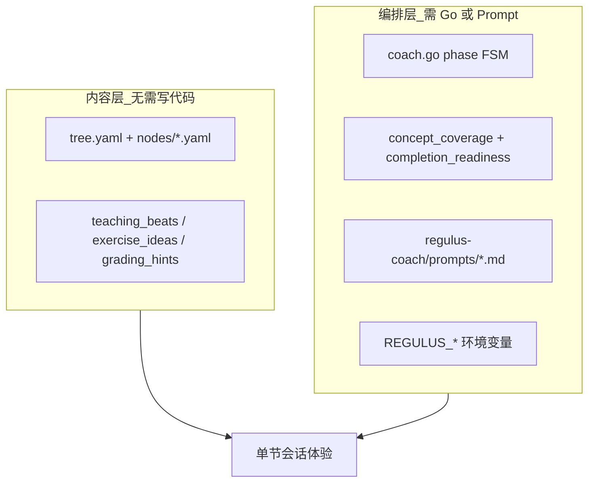

# 贡献 · 教学质量与教练逻辑

本文面向**贡献者**：说明 Regulus 教学质量如何拆层、维护者仍在权衡什么、以及你可以从哪改起。用户使用说明见 [教学模式](./teaching-model.md)、[教练流程](./coach-flow.md)。

完整 Fork / PR 流程见仓库 [CONTRIBUTING.md](https://github.com/liuwenji007/regulus-academy/blob/main/CONTRIBUTING.md)。

## 教学质量的两层

一节会话的体验 = **内容**（讲什么、考什么）× **编排**（何时练、何时点亮）。



| 层级 | 改什么 | 典型贡献者 |
|------|--------|------------|
| **内容层** | 节点边界、教考对齐、出题素材 | 领域专家、不写代码的协作者 |
| **编排层** | 状态机、点亮门槛、prompt、env | Go / Prompt 开发者 |

两层都重要：YAML 再好，门槛不合理也会「练太多」或「一点就亮」；逻辑再完善，节点边界模糊会导致考了未讲过的概念。

## 我们在纠结什么

以下是当前**未完全定论**的产品/教学权衡，不是 bug 清单。改默认行为前建议先开 `[讨论]` Issue 对齐。

| 纠结点 | 现状 | 欢迎讨论的方向 |
|--------|------|----------------|
| 规则 vs LLM 谁说了算 | 默认 `REGULUS_LLM_COMPLETION_CHECK=1`，覆盖/apply 多为**建议** | Cloud 是否固定策略；自托管是否需要更细粒度开关 |
| 熟悉/精通 apply 门槛 | 缺 apply 时倾向连题；LLM 可结合对话**软豁免** | 是否过严；非入门层是否一律要代码/找 bug 题 |
| 多概念覆盖阈值 | `core≥3` 且未考 `≥2` 才建议再练 | 是否按节点 `core_concepts` 数量动态化 |
| 申请掌握两次强制完成 | 第二次可强制点亮并记易错 | 是否太松；是否按 layer 限制 |
| 追问深讲阈值 | 同一概念第 2 次追问触发递进深讲 | 阈值 2 是否合适；review 阶段是否应优先错题概念 |
| LLM 评估失败 fallback | 无规则 defer 时，评估报错可能直接点亮 | 是否应一律保守连题 |
| 题序建议 vs 强制 apply | 缺 apply 时 `requireApply` 忽略首题 choice 建议 | prompt 文案与规则是否要对用户可见 |

有真实会话案例（层别、说了什么、期望 vs 实际 phase）的 `[体验]` Issue 特别有价值。

## 如何贡献

### A. 节点 YAML（最高性价比）

不需要写代码。格式见 [CONTRIBUTING · 加知识领域](https://github.com/liuwenji007/regulus-academy/blob/main/CONTRIBUTING.md#加一个新的知识领域)。

**自检清单：**

- `core_concepts` 每条都能被单独考查，且能在讲解里覆盖
- `common_mistakes` 能转化为 choice 或找 bug 素材
- `exercise_ideas` 含至少一条**应用向**（代码补全 / 排错），熟悉/精通层尤甚
- `grading_hints` 与 `core_concepts` 对齐，避免批改标准漂移
- `teaching_beats` 与 `core_concepts` 一一对应；`must_teach` 是讲解最低线，不是出题上限
- `first_exercise_level` 与节点难度一致（入门偏 `recognition`）

参考节点：[regulus-coach/domains/go-concurrency/nodes/channel.yaml](https://github.com/liuwenji007/regulus-academy/blob/main/regulus-coach/domains/go-concurrency/nodes/channel.yaml)

**验证：** 本地跑一节 → 是否出现「考了对话里没讲过的概念」→ 调整 `boundaries` / `exercise_ideas`。

### B. Prompt（`regulus-coach/prompts/`）

| 文件 | 影响 |
|------|------|
| `phase_explain.md` / `phase_review.md` | 讲解与补讲风格 |
| `phase_exercise.md` | 题序、choice/apply 形式 |
| `phase_grade.md` | 批改严格度 |
| `phase_mastery.md` | 点亮/申请掌握评估、规则软豁免说明 |
| `phase_deepen.md` | 追问递进深讲 |
| `core.md` | 角色边界（教练不自行宣称点亮） |

改 prompt 后请同步 [regulus-coach/protocol.md](https://github.com/liuwenji007/regulus-academy/blob/main/regulus-coach/protocol.md)，并跑：

```bash
go test ./internal/agent/...
```

测试用 mock LLM 验证 **FSM 与点亮路径**，不断言具体文案。

### C. 教练逻辑（Go）

| 文件 | 职责 |
|------|------|
| `internal/agent/completion_readiness.go` | 点亮前 LLM 评估、`tryCompleteAfterPass` |
| `internal/agent/concept_coverage.go` | 覆盖/apply 规则、`EvaluateDeferComplete` |
| `internal/agent/concept_followup.go` | 追问深讲匹配与阈值 |
| `internal/agent/mastery_skip.go` | 申请掌握入口、强制完成 |
| `internal/agent/coach.go` | explain / exercise / grade 状态机 |
| `internal/agent/prompt.go` | 待考查、规则建议等上下文注入 |

环境变量与组合示例：[环境变量](../reference/env.md)。

**测试约定：**

- 改点亮/连题/defer 逻辑必须补或改 `internal/agent/*_test.go`
- `REGULUS_LLM_COMPLETION_CHECK=0` — 测规则硬挡与传统申请掌握路径
- `REGULUS_LLM_COMPLETION_CHECK=1` — 测混合评估、软豁免、not ready 连题

## 提 Issue / PR

| 前缀 | 适合 |
|------|------|
| `[讨论]` | 上表纠结点、新门槛设计、默认 env 变更 |
| `[体验]` | 「不该亮却亮了」「连题太多」「考了未讲概念」等真实会话 |
| `[Bug]` | 行为与 [教练流程](./coach-flow.md) 文档不一致 |
| `[教练]` | 与 `[讨论]` / `[体验]` 同义别名，专指教学编排 |

动 `internal/agent/` 的 PR 请在描述中写清：**节点层别**、是否**申请掌握**、期望的 **phase** 与前后话术。有 Langfuse trace 或脱敏对话摘录更佳。

## 相关链接

- [教学模式](./teaching-model.md) — 用户能感知的设计
- [教练流程](./coach-flow.md) — phase、点亮规则（贡献逻辑的「验收标准」）
- [环境变量](../reference/env.md) — `REGULUS_STRICT_CONCEPT_COVERAGE` 等
- [DESIGN.md](https://github.com/liuwenji007/regulus-academy/blob/main/DESIGN.md) — 产品理念
- [CONTRIBUTING.md](https://github.com/liuwenji007/regulus-academy/blob/main/CONTRIBUTING.md) — Fork、分支、CI
