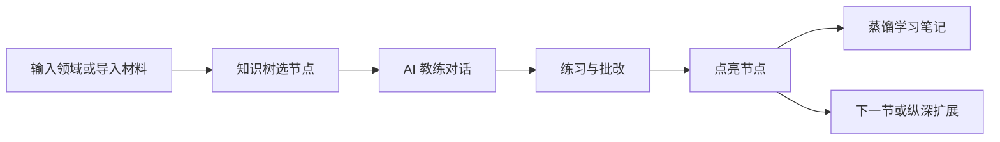

# 功能一览

Regulus 面向在职开发者的碎片化学习：有边界的知识地图 + 会追着你练习并给反馈的 AI 教练。

## 学习主路径

1. 在首页输入学习主题，或从 PDF/URL 导入建课
2. 在课程详情页选择节点，进入教练对话
3. 完成练习、通过掌握度评估后节点点亮
4. 在知识银河查看多领域全景进度

详见 [快速上手](./quick-start.md) 与 [界面预览](./screenshots.md)。

## 核心能力

| 功能 | 说明 |
|------|------|
| 建课 / 知识树 | 输入领域名，匹配内置 Skill 或由 LLM 生成完整路径 |
| 讲解 → 练习 → 反馈 | 单节点教学闭环：讲解、出题、批改、点亮 |
| 知识银河 | `#/graph` 多领域全景；星座聚类、进度光效、银河/目录双视图 |
| PDF/URL 导入 | `#/import` 摄取材料 → LLM 蒸馏大纲 → 异步生成知识树 |
| 多学习角色 | Web 切换角色，进度与课程列表按用户隔离 |
| IM 自然语言导航 | 自托管可接 Telegram、钉钉、飞书；规则优先 + LLM 兜底 |

## 课程进阶与导出

三项能力均在课程详情页 `#/tree/:id` 顶部操作栏。

### 纵深扩展

- **条件**：当前角色在该课程的完成度 ≥ 80%（默认阈值，见环境变量 `REGULUS_EXTEND_MIN_RATIO`）
- **效果**：按课程规模追加约 2～8 个进阶节点，**保留已有进度**
- **入口**：「解锁进阶路径」按钮 → 确认后异步建课，与首次建课共用进度轮询

### 导出 Skill 包

- **入口**：「导出 Skill 包」
- **产物**：`{slug}-skill.zip`，self-contained，可整目录放入 Agent 的 skills 目录直接练习
- **贡献社区**：解压后 `domains/{slug}/` 可按仓库 [CONTRIBUTING.md](https://github.com/liuwenji007/regulus-academy/blob/main/CONTRIBUTING.md) 提 PR

### 导出学习笔记（Obsidian Vault）

- **入口**：「导出学习笔记」
- **机制**：节点点亮后异步蒸馏对话为 Markdown，写入 `node_notes`；导出时组装 wikilink、MOC 索引
- **产物**：`{domain}-vault.zip`，解压后导入 Obsidian 即可
- **设计细节**：见仓库 [docs/knowledge-vault.md](https://github.com/liuwenji007/regulus-academy/blob/main/docs/knowledge-vault.md)

<strong>在线 Demo 说明</strong>：Cloud 版核心学习与导出功能可用；IM Gateway 需在自托管环境配置，见 <a href="./cloud-demo.md">在线体验版</a> 限制说明。

## 部署方式对比

| | 在线体验版 | 自托管 |
|---|-----------|--------|
| 安装 | 打开浏览器 | Docker 一键 / 源码 |
| 数据 | 共享实例 | 本机 SQLite |
| 日配额 + BYOK | ✅ | 用自己的 Key |
| IM 频道 | ❌ | ✅ |
| 管理员控制台 | 维护者 `#/admin` | — |

[立即体验在线 Demo](https://regulus-academy-web-production.up.railway.app) · [自托管部署](./self-host.md)
