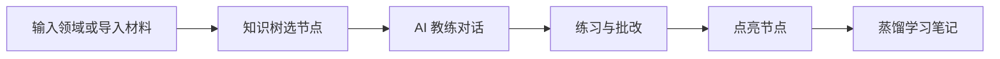

# 功能一览

这里汇总 Regulus 已提供的功能。第一次使用建议先看 [快速上手](./quick-start.md)。

## 从开始到学完

```mermaid
flowchart LR
  input[输入领域或导入材料] --> tree[知识树选节点]
  tree --> coach[AI 教练对话]
  coach --> exercise[练习与批改]
  exercise --> done[点亮节点]
  done --> notes[蒸馏学习笔记]
```

会话阶段与点亮规则见 [教练流程](./coach-flow.md)。

## 能力索引

| 功能 | 一句话 | 详细说明 |
|------|--------|----------|
| 建课 / 知识树 | 输入领域、目录或导入材料 | 见下方 |
| AI 教练 | 讲解 → 练习 → 批改 → 点亮 | [教练流程](./coach-flow.md) |
| [学习画像](./learning-profile.md) | 全局 + 按课摘要，裁剪讲解 | [学习画像](./learning-profile.md) |
| [行动助手](./action-assistant.md) | 过载分流、钉北星、今日行动 | [行动助手](./action-assistant.md) |
| 学习捷径 | 侧栏「上一节」+「今日推荐」 | [行动助手 · 与捷径](./action-assistant.md#与学习捷径的关系) |
| [课程体检](./course-audit.md) | 质检并补全节点，保留进度 | [课程体检](./course-audit.md) |
| 纵深扩展 | 完成度 ≥80% 追加进阶节点 | 见下方 |
| [知识图谱](./knowledge-graph.md) | 多领域全景、双视图双主题 | [知识图谱](./knowledge-graph.md) |
| [AI 模型](./model-config.md) | Web 设置 / `.env` / Demo 自带 Key | [AI 模型](./model-config.md) |
| [IM 频道](./im.md) | 手机学、进度与 Web 同步（仅自托管） | [IM 频道](./im.md) |
| [Coach Skill](./agent-offline.md) | 装到 Agent / IDE | [Coach Skill](./agent-offline.md) |
| [导出学习笔记](./learning-notes.md) | Obsidian vault zip | [导出学习笔记](./learning-notes.md) |
| 多学习角色 | 左下角切换，进度隔离 | 见下方 |

[界面预览](./screenshots.md) · [为什么是 Regulus](./why-regulus.md)

## 建课与导入

| 方式 | 入口 | 说明 |
|------|------|------|
| 输入领域 | 首页 | 匹配内置 Skill 或由模型生成；窄主题可关联父课 |
| 内置课程目录 | 首页「课程目录」 | 浏览全部内置课并一键开练（不知从哪开始时优先） |
| PDF / URL | 首页「导入」或导入页 | 摄取材料 → 蒸馏大纲 → 异步建树 |

父子课见 [教练流程 · 父子课程关联](./coach-flow.md#父子课程关联)。

## 多学习角色

左下角创建/切换角色（如「工作 Go」「面试 Agent」）。课程、进度、聊天按角色隔离。

## 纵深扩展与导出（摘要）

- **纵深扩展**：完成度 ≥80% →「解锁进阶路径」；与 [课程体检](./course-audit.md) 不同（体检改现有节点，扩展追加节点）
- **Coach Skill / Domain 包 / CLI**：见 [Coach Skill 下载](./agent-offline.md)
- **学习笔记**：见 [导出学习笔记](./learning-notes.md)

## 部署方式对比

| | 在线体验版 | 自托管 |
|---|-----------|--------|
| 安装 | 打开浏览器 | [Docker 一键](./self-host.md) |
| 模型 | 日配额 + [填写自己的 Key](./model-config.md#cloud-在线-demo) | [自己的 Key](./model-config.md) |
| IM | ❌ | ✅ Telegram / 钉钉 / 飞书 / 企微 |
| 数据 | 共享实例 | 本机 SQLite |

[立即体验](https://demo.awoshuile.cn) · [自托管](./self-host.md) · [在线体验版限制](./cloud-demo.md)
