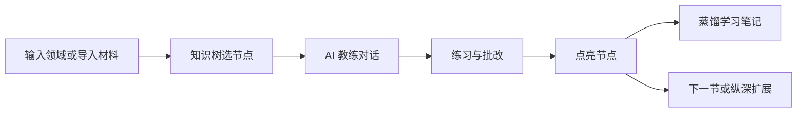

# 功能一览

Regulus 面向在职开发者的碎片化学习：有边界的知识地图 + 会追着你练习并给反馈的 AI 教练。

还没开始？先看 [快速上手](./quick-start.md)。

## 学习主路径


```mermaid
flowchart LR
  input[输入领域或导入材料] --> tree[知识树选节点]
  tree --> coach[AI 教练对话]
  coach --> exercise[练习与批改]
  exercise --> done[点亮节点]
  done --> notes[蒸馏学习笔记]
  done --> next[下一节或纵深扩展]
```

1. 在首页输入学习主题，或从 PDF/URL 导入建课
2. 在课程详情页选择节点，进入教练对话
3. 完成练习、通过掌握度评估后节点点亮
4. 在 [知识图谱](./knowledge-graph.md) 查看多领域全景进度

会话阶段与点亮规则见 [教练流程](./coach-flow.md)。

## 功能详解

| 功能 | 一句话 | 详细说明 |
|------|--------|----------|
| 建课 / 知识树 | 输入领域名或导入材料，生成可学的节点路径 | 见下方「建课与导入」 |
| AI 教练 | 讲解 → 练习 → 批改 → 点亮 | [教练流程](./coach-flow.md) |
| [知识图谱](./knowledge-graph.md) | 多领域全景、双视图双主题 | 图谱/目录、宣纸/星空、缩放 LOD |
| [AI 模型](./model-config.md) | 配置 API Key 与模型切换 | Web 设置、`.env`、Cloud BYOK |
| [IM 频道](./im.md) | 手机端学、进度与 Web 同步 | 仅自托管；Telegram / 钉钉 / 飞书 |
| 多学习角色 | 左下角切换，课程与进度隔离 | 见下方 |
| 学习画像 | 记住背景与目标，裁剪讲解 | `#/settings/profile` |
| 纵深扩展 | 完成度 ≥80% 解锁进阶节点 | 见下方 |
| 课程体检与优化 | 检查结构/教考对齐，勾选后补全节点内容 | 见下方 |
| 下载 Coach Skill | 主页下载 Agent 基础包（protocol、schemas、内置 domains） | 见下方 |
| 导出 Domain 包 | 课程详情导出单门课的 `tree.yaml` + 节点 YAML | 见下方 |
| CLI 建课 | `regulus build` 离线生成 `domains/` | 见下方 |
| [导出学习笔记](./learning-notes.md) | 蒸馏对话为 Markdown，Obsidian zip | [详细说明](./learning-notes.md) |

[界面预览](./screenshots.md) 可看主要页面截图。

## 建课与导入

| 方式 | 入口 | 说明 |
|------|------|------|
| 输入领域 | `#/` | 匹配内置 Skill 或由 LLM 生成知识树；窄主题可自动关联父课 |
| 内置课程目录 | `#/catalog` | 浏览全部内置 Skill 课程（Go 并发、Python、Rust、提示词设计等） |
| PDF / URL | `#/import` | 摄取材料 → LLM 蒸馏大纲 → 异步生成知识树 |

父子课程合并/独立建课见 [教练流程 · 父子课程关联](./coach-flow.md#父子课程关联)。

## 多学习角色

左下角可创建并切换学习角色（如「工作 Go」「面试 Agent」）。每个角色有独立的课程列表、进度与聊天；切换角色会刷新侧栏课程快捷，避免串号。

## 课程进阶与导出

纵深扩展与 Domain / 学习笔记导出在课程详情页 `#/tree/:id` 顶部操作栏；Coach Skill 在主页 `#/` 下载。

### 课程体检与优化

- **入口**：课程详情页「课程体检」（与纵深扩展、重新生成并列）
- **体检**：异步 Job，输出结构化报告（结构 / 节点完整性 / 教考对齐 / 前置依赖）与可选 AI 总评
- **优化**：勾选可自动修复项 → 生成补丁预览 → 确认后写入 `nodes_json`，**保留 node_key 与学习进度**
- **与纵深扩展区别**：体检/优化改**现有节点内容**；纵深扩展在完成后**追加**进阶节点
- **环境变量**：`REGULUS_COURSE_AUDIT_LLM=0` 仅规则体检；`REGULUS_COURSE_OPTIMIZE_LLM=0` 关闭 LLM 优化

### 纵深扩展

- **条件**：当前角色在该课程的完成度 ≥ 80%（默认阈值，见 `REGULUS_EXTEND_MIN_RATIO`）
- **效果**：按课程规模追加约 2～8 个进阶节点，**保留已有进度**
- **入口**：「解锁进阶路径」按钮 → 确认后异步建课

### 下载 Coach Skill（主页）

- **入口**：开始学习页 `#/` 右上角「Skill 下载」
- **产物**：`regulus-coach.zip`（lite：`SKILL.md`、`protocol-lite.md`、`agent-prompts.md`、`schemas/`（exercise/grade/progress）、内置 `domains/`、`scripts/`；**不含** `protocol.md`、`prompts/`、`bin/regulus`）
- **用途**：解压后放入 Agent skills 目录；**Linked** 优先（HTTP API），**Agent-lite** 默认可离线，**CLI** 可选高保真
- **CLI**：首次使用见包内 `SKILL.md` 引导，运行 `bash scripts/install-cli.sh` 或 [GitHub Releases](https://github.com/liuwenji007/regulus-academy/releases)
- **教程**：[Coach Skill 下载](./agent-offline.md) · 包内 `SKILL.md` / `USAGE.md`

### 导出 Domain 包（课程详情）

- **入口**：课程详情页「导出 Domain 包」
- **产物**：`{slug}-domain.zip`，解压后将 `{slug}/` 放入已安装 Skill 的 `domains/`
- **贡献**：可按 [CONTRIBUTING.md](https://github.com/liuwenji007/regulus-academy/blob/main/CONTRIBUTING.md) 提 PR

### CLI 建课与会话（可选）

```bash
make cli                              # 开发者本地构建
bash scripts/install-cli.sh           # Skill 包内按需安装 CLI
regulus build "想学 Rust"              # 需 .env 中 LLM_API_KEY
regulus session start --slug go-concurrency
bash scripts/api-session.sh start --slug go-concurrency   # Linked，无需 CLI
```

`build-domain.sh` 三档降级：本地 CLI → 远程 API 建课 → 提示 Web 导出 Domain 包。Linked / CLI 模式禁止 Agent 即兴教练；Agent-lite 遵循 `protocol-lite.md`。

### 导出学习笔记（Obsidian Vault）

- **入口**：课程详情页「导出学习笔记」
- **机制**：节点点亮后异步蒸馏对话为 Markdown；导出时组装 wikilink、MOC 索引
- **产物**：`{domain}-vault.zip`，解压后导入 Obsidian 即可

完整说明见 **[导出学习笔记](./learning-notes.md)**。设计细节见仓库 [docs/knowledge-vault.md](https://github.com/liuwenji007/regulus-academy/blob/main/docs/knowledge-vault.md)。

## 部署方式对比

| | 在线体验版 | 自托管 |
|---|-----------|--------|
| 安装 | 打开浏览器 | [Docker 一键](./self-host.md) |
| 模型 | 日配额 + [BYOK](./model-config.md#cloud-在线-demo) | [自己的 Key](./model-config.md) |
| IM 频道 | ❌ | ✅ [IM 频道](./im.md) |
| 数据 | 共享实例 | 本机 SQLite |

<div class="docs-callout">

在线 Demo 核心学习与导出可用；IM 需自托管，见 <a href="./cloud-demo.md">在线体验版</a> 限制说明。

</div>

[立即体验在线 Demo](https://regulus-academy-web-production.up.railway.app) · [自托管部署](./self-host.md)
