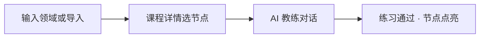

# 快速上手

## 这是什么

你告诉它想学什么（比如「Go 并发」），它把这个大主题拆成一张**知识地图**，你像打游戏一样一个个小关卡去学：**看讲解 → 做一道小练习 → 它给你批改 → 过了就把这个知识点标成「学会」**。学完可以接着下一关。全程用一个 AI 对话框完成，一次大约 15 分钟。

几个名词：

| 词 | 意思 |
|----|--------|
| **节点** | 地图上的一个小知识点（一关），比如「什么是 goroutine」 |
| **点亮** | 你把这一关学会、练习过了，系统给它打上「已完成」的标记 |
| **教练** | 陪你的 AI：不像老师照本宣科讲一整章，而是只讲这一关、盯着你练会 |

## 三步走完第一关

| 步骤 | 你要做的 | 在哪 |
|------|----------|------|
| 1 | 输入想学的主题（如「Go 并发」），或从课程目录挑一门、上传资料开课 | 首页 |
| 2 | 在知识地图里点一个小知识点 | 课程详情页 |
| 3 | 听 AI 讲 → 打字说「开始练习」→ 作答 → 通过后这一关点亮 | 教练对话页 |

<details>
<summary>查看完整流程图</summary>



</details>

### 卡住时怎么走

| 你的情况 | 去哪 |
|----------|------|
| 不知从哪开课 | 首页的「课程目录」，挑一门一键开练 |
| 事情太多、节奏乱 | 侧栏的 [行动助手](./action-assistant.md) |
| 想续上次 | 侧栏「上一节」；「今日推荐」优先来自行动助手计划 |
| 术语 / 读音听不懂 | 教练页划词 → [划词助教](./aside-assistant.md) |

教练阶段与点亮规则见 [教练流程](./coach-flow.md)。

## 方式 A：在线 Demo（推荐，零 Key）

1. 打开 [在线 Demo](https://demo.awoshuile.cn)
2. 创建学习角色（输入昵称）


3. 在首页输入主题，或打开「课程目录」挑一门开练
4. 选节点 → AI 教练 → 练习点亮

平台提供每日免费额度；用尽后可填写自己的 Key 继续。限制见 [在线体验版](./cloud-demo.md)。

## 方式 B：本机 Docker（数据留本机，需 Key）

```bash
curl -fsSL https://raw.githubusercontent.com/liuwenji007/regulus-academy/main/scripts/install.sh | bash
```

或：

```bash
git clone https://github.com/liuwenji007/regulus-academy.git
cd regulus-academy
cp .env.example .env   # 填入 LLM_API_KEY
docker compose -f docker-compose.image.yml up -d
```

访问 `http://localhost:8080`。IM 见 [自托管部署](./self-host.md#im-频道)。

## 接下来读什么

| 你想… | 去看 |
|--------|------|
| 搞清教练怎么点亮 | [教练流程](./coach-flow.md) |
| 恢复学习节奏 | [行动助手](./action-assistant.md) |
| 画像如何影响讲解 | [学习画像](./learning-profile.md) |
| 课质量体检 | [课程体检](./course-audit.md) |
| 配置模型 / 自托管 | [AI 模型](./model-config.md) · [自托管](./self-host.md) |
| 理解差异化 | [为什么是 Regulus](./why-regulus.md) |
| 全部能力索引 | [功能一览](./features.md) |
