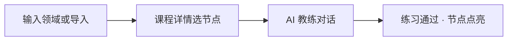

# 快速上手

用最少步骤走完**第一次学习闭环**：建课 → 选节点 → 教练对话 → 练习点亮。

## 学习主路径（3 步）



| 步骤 | 做什么 | 页面 |
|------|--------|------|
| 1 | 输入「Go 并发」等领域名，或从目录/导入开课 | `#/`、`#/catalog` 或 `#/import` |
| 2 | 在知识树中选一个节点 | `#/tree/:id` |
| 3 | 听讲解 → 说「开始练习」→ 作答 → 通过评估 | `#/coach/:sessionId` |

点亮后可在 [知识图谱](./knowledge-graph.md)（`#/graph`）查看全景，或在课程页点「继续 · 下一节」。侧栏「上一节 / 今日推荐」可快速续学。

教练阶段、话术与点亮规则详见 [教练流程](./coach-flow.md)。

## 方式 A：在线 Demo（推荐，零配置）

1. 打开 [在线 Demo](https://demo.awoshuile.cn)
2. 创建学习角色（输入昵称）


3. 在首页输入学习主题（如「Go 并发」），或打开 `#/catalog` 从内置课目录开练
4. 在知识树中选节点，开始 AI 教练对话
5. 完成练习后节点点亮

平台提供每日免费教练额度；用尽后可按页面提示填写自己的 LLM Key（BYOK）。限制说明见 [在线体验版](./cloud-demo.md)。

## 方式 B：本机 Docker（完整功能）

适合希望数据留在本机、或需要 IM 机器人的用户。

```bash
curl -fsSL https://raw.githubusercontent.com/liuwenji007/regulus-academy/main/scripts/install.sh | bash
```

或手动：

```bash
git clone https://github.com/liuwenji007/regulus-academy.git
cd regulus-academy
cp .env.example .env   # 填入 LLM_API_KEY
docker compose -f docker-compose.image.yml up -d
```

访问 `http://localhost:8080`，学习流程与在线 Demo 相同。IM 配置见 [自托管部署](./self-host.md#im-频道)。

## 接下来读什么

| 你想… | 去看 |
|--------|------|
| 了解全部功能 | [功能一览](./features.md) |
| 事情太多、想恢复学习节奏 | [行动助手](./action-assistant.md) |
| 知识图谱怎么用 | [知识图谱](./knowledge-graph.md) |
| 配置 API Key / 换模型 | [AI 模型](./model-config.md) |
| 搞清教练怎么对话、怎么点亮 | [教练流程](./coach-flow.md) |
| 导出 Obsidian 学习笔记 | [导出学习笔记](./learning-notes.md) |
| 看界面长什么样 | [界面预览](./screenshots.md) |
| 理解为什么这样教 | [教学模式](./teaching-model.md) |
| 改代码或提 PR | [本地开发](./development.md) · [参与贡献](./contributing.md) |
