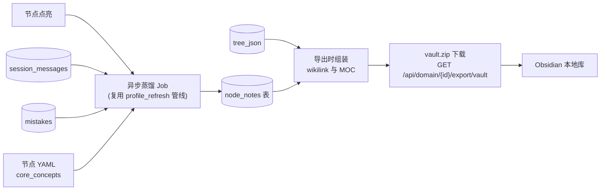

# 知识沉淀设计草案 — Obsidian Vault 导出

> 阶段：Phase 5 · 规划中
> 最后更新：2026-06-10

学习闭环的第五环：讲解 → 练习 → 反馈 → 点亮 → **沉淀**。把 SQLite 里的学习成果（对话、错题、掌握度）转化为用户可带走的本地 Markdown 知识库，兼容 Obsidian。

---

## 数据流



---

## 数据库设计

### 新表：`node_notes`

```sql
CREATE TABLE IF NOT EXISTS node_notes (
    user_id    TEXT NOT NULL,
    domain_id  TEXT NOT NULL,
    node_key   TEXT NOT NULL,
    content_md TEXT NOT NULL,
    updated_at DATETIME NOT NULL DEFAULT CURRENT_TIMESTAMP,
    PRIMARY KEY (user_id, domain_id, node_key),
    FOREIGN KEY (user_id)   REFERENCES users(id),
    FOREIGN KEY (domain_id) REFERENCES domains(id)
);
```

---

## 异步蒸馏管线

### 复用点

`internal/agent/profile_refresh.go` 中的 `scheduleProfileRefresh` 已经建立了完整的异步模式：goroutine + `context.WithTimeout(60s)` + `observability.Trace`。新的笔记蒸馏 job 遵循完全相同的结构。

### 新增任务类型

```go
// internal/agent/tasks.go（或 coach.go 中 TaskType 枚举）
TaskNoteDistill TaskType = "note_distill"
```

### 触发时机

节点点亮（`status = "completed"`）后，在 `scheduleProfileRefresh` 调用的同一处（`coach_next.go`）并发调用 `scheduleNoteDistill`。两个 job 互不依赖，可以同时跑。

### Prompt 指令（草稿）

```
你是一位学习教练。请根据以下【对话摘录】，为学生生成一篇 300~500 字的学习笔记。

要求：
- 用第一人称「我」写，像学生自己记的笔记
- 突出本节的核心洞察，而不是复述对话
- 如有错题记录，提炼为「踩过的坑」
- 结构：核心理解（2~3 段）→ 关键概念列举 → 踩坑记录
- 不要包含题目原文，只保留思路

【节点】：{node_title}（{domain_name} · {layer}）
【核心概念】：{core_concepts}
【对话摘录】：
{transcript}
【错题记录】：
{mistakes}
```

---

## 笔记 Markdown 模板

每个点亮节点生成一个 `.md` 文件，示例：

```markdown
---
domain: "Go 并发"
module: "基础"
node: "goroutine_basics"
layer: "入门"
mastery: 0.85
status: "completed"
tags: [go, concurrency, goroutine]
updated: 2026-06-10
---

# Goroutine 基础

## 核心理解

我之前总以为 goroutine 就是线程，但其实差别很大……

## 关键概念

- `go` 关键字启动一个 goroutine，开销极小（初始栈 2KB）
- Go runtime 做 M:N 调度，goroutine 不与 OS 线程 1:1 绑定
- goroutine 泄漏是常见坑：启动后没有退出机制

## 踩过的坑

- 以为 goroutine 结束后 main 会等待 → 实际 main 退出所有 goroutine 都会被杀
- 用 `time.Sleep` 做同步 → 应该用 channel 或 sync.WaitGroup

## 相关节点

- [[Channel 基础]]
- [[sync.WaitGroup]]

#flashcards

Goroutine 与线程的核心区别是什么？
?
Go runtime 做 M:N 调度；goroutine 栈初始 2KB，可动态增长；由 runtime 而非 OS 调度。
```

---

## Vault 目录结构

```
vault.zip
└── Go 并发/
    ├── _MOC.md              ← 领域索引（Map of Content）
    ├── goroutine_basics.md
    ├── channel_basics.md
    ├── select_statement.md
    └── ...
```

### MOC 模板（`_MOC.md`）

```markdown
---
domain: "Go 并发"
type: MOC
updated: 2026-06-10
---

# Go 并发 — 学习地图

## 入门

- [[goroutine_basics]] ✅ 掌握度 85%
- [[channel_basics]]   ✅ 掌握度 90%
- [[select_statement]] 🔄 掌握度 60%

## 熟悉

- [[context_usage]]    ⬜ 未开始

## 精通

- [[scheduler_internals]] ⬜ 未开始
```

掌握度图例：✅ ≥ 80%　🔄 40~79%　⬜ < 40% 或未开始

---

## API 设计

### 导出接口

```
GET /api/domain/{id}/export/vault
```

- 鉴权：与其他 domain API 一致，取 `userID(r)`
- 响应：`Content-Type: application/zip`，`Content-Disposition: attachment; filename="<domain-name>-vault.zip"`
- 逻辑：
  1. 读取该 domain 的 `tree_json`（节点结构 + module/layer 信息）
  2. 读取 `node_notes` 中该用户该 domain 的所有笔记
  3. 读取 `user_progress`（mastery / status）
  4. 读取 `mistakes`（踩坑记录，按 node_key 分组）
  5. 对每个已点亮节点生成 `.md`，无笔记内容的节点生成占位文件（只有 frontmatter）
  6. 生成 `_MOC.md`，写入 zip

### 对齐现有导出路由

```go
// internal/api/handler.go，参考 exportDomain
mux.HandleFunc("GET /api/domain/{id}/export/vault", h.exportDomainVault)
```

---

## 复用点清单

| 现有代码 | 复用方式 |
|---------|---------|
| `internal/agent/profile_refresh.go` — `scheduleProfileRefresh` | 笔记蒸馏 job 的 goroutine + timeout + Trace 模式完全照搬 |
| `internal/agent/profile_refresh.go` — `formatTranscriptForProfile` | 直接复用，把对话格式化为蒸馏输入 |
| `internal/api/handler.go` — `exportDomain` | zip 打包和路由注册模式 |
| `migrations/` | 新增 `node_notes` 表 migration 文件 |
| `tree_json` → `[[wikilink]]` 生成 | 遍历 `TreeNode.Requires` 字段构造内链 |
| `mistakes` 表 | 按 node_key 聚合 `concept` 字段作为「踩坑记录」 |
| `core_concepts`（节点 YAML） | 由 `registry.GetNode` 返回，直接注入 Prompt |

---

## Web 入口

`web/src/pages/tree.ts` — 在「导出 Skill 包」按钮附近增加「导出学习笔记（Obsidian）」按钮，点击后 `fetch` `/api/domain/{id}/export/vault` 并触发浏览器下载。

---

## 非目标（MVP 范围外）

- **不直接 dump 聊天记录**：对话原文不写入笔记，只保留 LLM 蒸馏后的洞察
- **不做双向同步**：vault 是只读导出，用户在 Obsidian 里的修改不回写
- **不做实时增量推送**：只提供手动触发的「导出」，不监听 vault 目录变化
- **不在 MVP 集成 RAG**：笔记暂时不反哺教学上下文（留给 LLM Wiki 阶段）
- **不要求 Embedding**：保持「一个 Key 就能用」原则

---

## LLM Wiki（远期扩展，待验证后再投入）

MVP 上线后，通过用户行为（是否真的打开过导出的 vault、是否回看过笔记）验证「知识沉淀」价值再投入：

- **Agent 维护笔记**：节点复习或纵深扩展后，Agent 自动更新笔记内容（而非重新生成）
- **跨 domain 自动建链**：识别不同领域笔记的概念重叠，自动添加 `[[跨域链接]]`
- **RAG 反哺教学**：对 vault 做 Embedding，教练对话时引用「你之前记过……」
- **注意事项**：RAG 需要 Embedding API，应设计为可选模块，不破坏零配置原则
